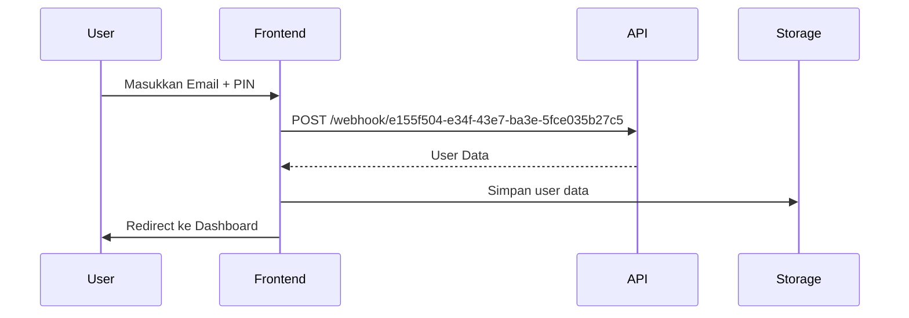

# Field Investigator App - Frontend Web Technical Documentation

> **Dokumentasi Teknis untuk Frontend Web Engineer**
> 
> Dokumen ini menyediakan spesifikasi lengkap untuk membangun frontend web version dari Field Investigator Mobile App. Mencakup screen flow, fitur, API endpoints, data models, dan business logic.

**Versi:** 1.0  
**Dibuat:** November 4, 2025  
**Target:** Web Application (Tech stack agnostic)

---

## 📑 Table of Contents

1. [Overview](#overview)
2. [Architecture](#architecture)
3. [User Authentication Flow](#user-authentication-flow)
4. [Screen Flow & Navigation](#screen-flow--navigation)
5. [Pages & Features](#pages--features)
6. [API Documentation](#api-documentation)
7. [Data Models](#data-models)
8. [Business Logic & Validation](#business-logic--validation)
9. [State Management Requirements](#state-management-requirements)
10. [Performance & Caching](#performance--caching)

---

## 🎯 Overview

### Deskripsi Aplikasi
Field Investigator App adalah aplikasi untuk field agent/debt collector yang melakukan kunjungan/kontak ke debtor. Aplikasi mobile saat ini sudah berjalan di Android/iOS, dan versi web ini akan digunakan untuk:
- Dashboard admin/supervisor untuk monitoring
- Data entry backup ketika agent tidak membawa HP
- Reporting dan analytics

### Tech Stack Requirements
- **Frontend:** Bebas (React, Vue, Angular, dll)
- **State Management:** Diperlukan untuk handle auth, caching, dan data flow
- **HTTP Client:** Axios / Fetch API
- **Maps Integration:** Google Maps / Leaflet (untuk location features)
- **Image Upload:** Multipart form data support
- **Storage:** LocalStorage / SessionStorage untuk caching

---

## 🏗️ Architecture

### High-Level Architecture

```
┌─────────────────┐
│   Web Browser   │
└────────┬────────┘
         │
    ┌────▼────┐
    │ Frontend│
    │   App   │
    └────┬────┘
         │
    ┌────▼──────────────────────────────┐
    │   API Gateway (n8n.skorcard.app)  │
    └────┬──────────────────────────────┘
         │
    ┌────▼────────┐
    │  Zoho CRM   │
    │  Backend    │
    └─────────────┘
```

### API Base URLs
- **Production:** `https://n8n-sit.skorcard.app`
- **Authentication:** `https://n8n.skorcard.app`
- **Photo Service:** `https://n8n.skorcard.app`

### Request/Response Format
- **Content-Type:** `application/json`
- **Authorization:** Bearer token (setelah login)
- **Timeout:** 30 seconds untuk semua requests

---

## 🔐 User Authentication Flow

### Login Sequence



### Login API

**Endpoint:** `POST https://n8n.skorcard.app/webhook/e155f504-e34f-43e7-ba3e-5fce035b27c5`

**Request Body:**
```json
{
  "email": "agent@skorcard.com",
  "pin": "1234"
}
```

**Response Success (200):**
```json
[
  {
    "id": "3770745000008039461",
    "name": "John Doe",
    "email": "agent@skorcard.com",
    "role": "Field Investigator",
    "phone": "+628123456789",
    "team": "Jakarta Team",
    "Created_Time": "2024-01-15T08:30:00+07:00",
    "Modified_Time": "2024-01-15T08:30:00+07:00"
  }
]
```

**Response Error (400/401):**
```json
{
  "error": "Invalid credentials",
  "message": "Email or PIN is incorrect"
}
```

**Frontend Requirements:**
1. Validasi email format
2. Validasi PIN (4-6 digit numerik)
3. Simpan user data ke localStorage/sessionStorage
4. Set auth header untuk semua subsequent requests
5. Handle error dengan user-friendly message

### Logout Flow
1. Clear localStorage/sessionStorage
2. Clear cache data
3. Redirect ke login page

---

## 🗺️ Screen Flow & Navigation

### Main Navigation Structure

```
Login
  └─> Main Screen (Bottom Navigation)
       ├─> Dashboard (Tab 1)
       │    ├─> Performance Stats
       │    └─> Quick Actions
       │
       ├─> Clients (Tab 2)
       │    ├─> All Clients List
       │    ├─> Contactability History Tab
       │    ├─> Client Details
       │    │    ├─> Client Info
       │    │    ├─> Contact Info
       │    │    ├─> Financial Info
       │    │    ├─> Location Map
       │    │    ├─> Photos (KTP, Selfie)
       │    │    └─> Contactability History
       │    │
       │    ├─> Contactability Form
       │    │    ├─> Visit Form
       │    │    ├─> Call Form
       │    │    └─> Message Form
       │    │
       │    ├─> Contactability Details
       │    ├─> Location History
       │    └─> Skip Tracing
       │
       └─> Profile (Tab 3)
            ├─> User Info
            ├─> Settings
            └─> Logout
```

### Route Mapping (Recommended)

```
Authentication Routes:
/login                          -> Login Screen
/logout                         -> Logout (clear session, redirect to login)

Main Routes:
/                              -> Redirect to /dashboard (if authenticated)
/dashboard                     -> Dashboard Tab (Performance stats)

Client Routes:
/clients                       -> Clients List (with tabs: All Clients, History)
/clients/all-locations         -> All Client Locations Map (aggregate view)
/clients/:clientId             -> Client Details
/clients/:clientId/contact     -> Contactability Form (add new contact)
/clients/:clientId/history     -> Client Location History (visits timeline + map)
/clients/:clientId/skip-trace  -> Skip Tracing (alternative phone numbers)

Contactability Routes:
/contactability                -> All Contactability History (agent's records)
/contactability/:id            -> Contactability Details (single record)
/contactability/:id/edit       -> Edit Contactability (optional)

Profile Routes:
/profile                       -> Profile Tab (user info, settings)
/profile/settings              -> Settings Page (optional)
/profile/statistics            -> Personal Statistics (optional)

Error Routes:
/404                           -> Not Found Page
/403                           -> Forbidden Page
/500                           -> Server Error Page
```

**Route Guards:**
```javascript
// Protect routes that require authentication
const protectedRoutes = [
  '/dashboard',
  '/clients',
  '/contactability',
  '/profile',
];

// Check authentication before accessing protected routes
function requireAuth(to, from, next) {
  const isAuthenticated = checkAuthStatus();
  
  if (!isAuthenticated) {
    // Redirect to login with return URL
    next(`/login?returnUrl=${encodeURIComponent(to.path)}`);
  } else {
    next();
  }
}

// After successful login, redirect to returnUrl or dashboard
function handleLoginSuccess(returnUrl) {
  const destination = returnUrl || '/dashboard';
  router.push(destination);
}
```

---

## 📱 Pages & Features

### 1. Login Page

**Path:** `/login`

**UI Components:**
- Email input field
- PIN input field (numeric, 4-6 digits)
- Login button
- Error message display
- Loading indicator

**Features:**
- Form validation
- Remember me (optional)
- Error handling
- Auto-redirect if already logged in

**State:**
```typescript
interface LoginState {
  email: string;
  pin: string;
  isLoading: boolean;
  error: string | null;
}
```

---

### 2. Dashboard Page

**Path:** `/dashboard`

**Layout:** Tab 1 of Main Screen

**Features:**

#### A. Performance Cards
Menampilkan statistik performa agent hari ini/bulan ini

**API Call:**
```
POST https://n8n-sit.skorcard.app/webhook/e3f3398d-ff5a-4ce6-9cee-73ab201119fb
Body: { "fi_owner": "agent@skorcard.com" }
```

**Response:**
```json
[
  {
    "Visit_Count": 22,
    "Call_Count": 2,
    "Message_Count": 44,
    "RPC_Count": 6,
    "TPC_Count": 3,
    "OPC_Count": 12,
    "PTP_Count": 3,
    "PTP_Count_This_Month": 3
  }
]
```

**Display Cards:**
1. **Visit Card**
   - Total: `Visit_Count`
   - RPC: `RPC_Count` (Right Party Contact)
   - TPC: `TPC_Count` (Third Party Contact)
   - OPC: `OPC_Count` (Other Party Contact)

2. **Call Card**
   - Total: `Call_Count`

3. **Message Card**
   - Total: `Message_Count`

4. **PTP Card** (Promise to Pay)
   - All Time: `PTP_Count`
   - This Month: `PTP_Count_This_Month`

**Caching:** Cache response for 3 minutes

#### B. Quick Actions
- Button: "👥 Lihat Semua Klien" → Navigate to `/clients`
- Button: "🗺️ Lihat Semua Lokasi" → Navigate to `/clients/all-locations`
- Button: "📊 Download Report" → Export dashboard as PDF
- Button: "🔄 Refresh Data" → Force refresh dashboard (bypass cache)

#### C. Period Filter
- **Dropdown: "📅 Pilih Periode"** untuk filter data dashboard
  - Today (default)
  - Yesterday
  - This Week
  - Last Week
  - This Month
  - Last Month
  - Last 7 Days
  - Last 14 Days
  - Last 30 Days
  - Last 60 Days
  - Last 90 Days
  - This Quarter
  - Last Quarter
  - This Year
  - Last Year
  - Custom Range (date picker from-to)

**Note:** Setiap perubahan periode akan memanggil ulang Dashboard Performance API dengan parameter tanggal yang sesuai

#### D. Performance Charts (Optional)
- Line chart: Visit/Call/Message trend over time
- Bar chart: PTP by week/month
- Pie chart: Contact result distribution
- Interactive: Click to filter data

---

### 3. Clients List Page

**Path:** `/clients`

**Layout:** Tab 2 of Main Screen

**Features:**

#### A. Client List Tab

**API Call:**
```
POST https://n8n.skorcard.app/webhook/a307571b-e8c4-45d2-9244-b40305896648
Body: { "fi_owner": "agent@skorcard.com" }
```

**Response:**
```json
[
  {
    "data": [
      {
        "id": "3770745000008039001",
        "user_ID": "USER123",
        "Name1": "John Doe",
        "Full_Name": "SC12345678",
        "Last_Name": "Doe",
        "Mobile": "+628123456789",
        "Email": "john@example.com",
        "CA_Line_1": "Jl. Sudirman No. 123",
        "CA_Line_2": "Kelurahan ABC",
        "CA_City": "Jakarta",
        "Current_Status": "Active",
        "Total_OS_Yesterday1": "5000000",
        "Last_Statement_MAD": "500000",
        "Last_Statement_TAD": "5500000",
        "Last_Payment_Amount": "250000",
        "Days_Past_Due": "30",
        "DPD_Bucket": "1-30",
        "Created_Time": "2024-01-15T08:30:00+07:00",
        "Modified_Time": "2024-01-15T08:30:00+07:00",
        "Call_Notes": "Client meminta extension"
      }
    ]
  }
]
```

**Display Components:**

1. **Search Bar**
   - Placeholder: "Cari nama, nomor HP, atau ID..."
   - Search by: Name1, Full_Name, Mobile, user_ID
   - Real-time filtering (debounce 300ms)
   - Clear button (X) to reset search
   - Icon: 🔍

2. **Filter & Sort Toolbar**
   
   **Filter Options:**
   - Status Dropdown:
     - All (default)
     - Active
     - Inactive
     - Paid Off
     - Written Off
     - Settled
     - Legal Action
     - Skip Trace
     - Bankrupt
     - Deceased
   
   - DPD Bucket Dropdown:
     - All (default)
     - Current (0 days)
     - 1-30 days
     - 31-60 days
     - 61-90 days
     - 91-120 days
     - 121-180 days
     - 181-365 days
     - >365 days
   
   - Outstanding Range Slider:
     - Min: 0
     - Max: 100,000,000
     - Step: 1,000,000
   
   **Sort Options:**
   - Dropdown with options:
     - Name (A-Z)
     - Name (Z-A)
     - Outstanding (High to Low)
     - Outstanding (Low to High)
     - DPD (High to Low)
     - DPD (Low to High)
     - Last Modified (Newest First)
     - Last Modified (Oldest First)
     - Last Contact (Recent First)
     - Last Contact (Oldest First)
     - Last Payment (Recent First)
     - Last Payment (Oldest First)
   
   **Action Buttons:**
   - Button: "Reset Filters" → Clear all filters and sort
   - Button: "Export List" → Download filtered list as CSV
   - Badge: "Showing X of Y clients"

3. **Client Card** (foreach client)
   ```
   ┌─────────────────────────────────────────────────────┐
   │ John Doe                                      [⋮]   │
   │ 📱 +628123456789  [📞] [💬] [📋]                    │
   │ 📍 Jl. Sudirman No. 123, Jakarta  [🗺️]             │
   │ 💰 Outstanding: Rp 5.000.000                        │
   │ ⏰ DPD: 30 days | Bucket: 1-30                     │
   │ 📊 Status: Active                                   │
   │ [Lihat Detail] [Tambah Kontak] [Lihat Lokasi]      │
   └─────────────────────────────────────────────────────┘
   ```
   
   **Card Actions:**
   - Click anywhere on card → Navigate to `/clients/:id`
   - Click [⋮] menu → Show options:
     - Lihat Detail
     - Tambah Kontak
     - Lihat Lokasi
     - Lihat History
     - Skip Tracing
     - Copy ID
   - Click [📞] → Call phone number
   - Click [💬] → Open WhatsApp
   - Click [📋] → Copy phone to clipboard
   - Click [🗺️] → Open address in Google Maps
   - Click "Lihat Detail" → Navigate to `/clients/:id`
   - Click "Tambah Kontak" → Navigate to `/clients/:id/contact`
   - Click "Lihat Lokasi" → Navigate to `/clients/:id/history`

4. **Bulk Actions** (Optional)
   - Checkbox on each card for selection
   - Action bar appears when items selected:
     - Export Selected
     - Assign to Agent
     - Send Bulk WhatsApp
     - Mark as Priority

5. **Pagination**
   - Show 20 clients per page (default)
   - Pagination controls at bottom:
     - Previous/Next buttons
     - Page numbers (1, 2, 3, ..., Last)
     - Jump to page input
     - Items per page dropdown: 10, 20, 50, 100
   - Virtual scrolling for mobile (infinite scroll)

**Client Name Logic:**
```javascript
function getClientName(client) {
  const name1 = client.Name1;
  const fullName = client.Full_Name;
  const lastName = client.Last_Name;

  // Jika Name1 kosong/null
  if (!name1) {
    return fullName || lastName || 'Unknown';
  }

  // Jika Full_Name dimulai dengan "SC" + angka
  if (fullName && /^SC\d/.test(fullName)) {
    return name1;
  }

  // Jika Name1 dan Full_Name kosong
  if (!name1 && !fullName) {
    return lastName || 'Unknown';
  }

  // Default: Name1
  return name1;
}
```

**Actions:**
- Click card → Navigate to `/clients/:id`
- Click "Kontak" button → Navigate to `/clients/:id/contact`

**Caching:** Cache client list for 5 minutes

#### B. Contactability History Tab

**API Call:**
```
POST https://n8n-sit.skorcard.app/webhook/d540950f-85d2-4e2b-a054-7e5dfcef0379
Body: { "fi_owner": "agent@skorcard.com" }
```

**Response:**
```json
[
  {
    "data": [
      {
        "id": "contact_001",
        "client_id": "3770745000008039001",
        "client_name": "John Doe",
        "Channel": "Visit",
        "Visit_Action": "RPC",
        "Contact_Result": "Promise to Pay (PTP)",
        "Visit_Notes": "Client berjanji bayar tanggal 15",
        "Contact_Date": "2024-11-04T10:30:00+07:00",
        "Agent_Name": "Agent 1",
        "image1": "https://example.com/photo1.jpg",
        "latitude": -6.2088,
        "longitude": 106.8456
      }
    ]
  }
]
```

**Display Components:**

1. **Filter by Date Range**
   - Today
   - Yesterday
   - Last 7 Days
   - Last 14 Days
   - Last 30 Days
   - This Week
   - Last Week
   - This Month
   - Last Month
   - Last 3 Months
   - Last 6 Months
   - This Year
   - Last Year
   - All Time
   - Custom Range (date picker)

2. **Filter by Channel**
   - All (default)
   - Visit
   - Call
   - Message

3. **Filter by Result** (Optional)
   - All (default)
   - Promise to Pay (PTP)
   - Already Paid
   - Negotiation
   - Refuse to Pay
   - Not Found
   - Menghindar
   - Follow Up
   - Other

4. **Sort Options**
   - Newest First (default)
   - Oldest First
   - Client Name (A-Z)
   - Client Name (Z-A)

5. **History Card** (foreach record)
   ```
   ┌─────────────────────────────────┐
   │ Visit - RPC                      │
   │ John Doe                        │
   │ 04 Nov 2024, 10:30              │
   │ Promise to Pay (PTP)            │
   │ Notes: Client berjanji bayar... │
   │ [Lihat Detail]                  │
   └─────────────────────────────────┘
   ```

**Actions:**
- Click card → Navigate to `/contactability/:id`
- Long press/right click → Context menu:
  - View Details
  - Copy Notes
  - Share
  - Export

**Bulk Actions:**
- Checkbox selection on cards
- Bulk actions when items selected:
  - Export Selected to CSV
  - Export Selected to PDF
  - Delete Selected (with confirmation)

---

### 4. Client Details Page

**Path:** `/clients/:clientId`

**Data Source:** 
- Use client data from Clients List API
- Client ID dari URL parameter
- Additional data: Photos, Contactability history

**Sections:**

#### A. Client Information Card
```
Name: [Name dari logic getClientName]
Phone: [Mobile] 
  - Icon button: 📞 Call → tel:[Mobile]
  - Icon button: 💬 WhatsApp → https://wa.me/[Mobile without +]
  - Icon button: 📋 Copy → Copy phone number to clipboard
Email: [Email]
  - Icon button: ✉️ Email → mailto:[Email]
  - Icon button: 📋 Copy → Copy email to clipboard
Status: [Current_Status]
Address: [CA_Line_1, CA_Line_2, CA_City]
  - Icon button: 📍 View on Map → Open Google Maps
  - Icon button: 📋 Copy → Copy full address to clipboard
```

**Interactive Features Implementation:**

```javascript
// Call Phone
function callPhone(phoneNumber) {
  window.location.href = `tel:${phoneNumber}`;
}

// Open WhatsApp
function openWhatsApp(phoneNumber) {
  // Remove + and spaces
  const cleanNumber = phoneNumber.replace(/[\s+]/g, '');
  window.open(`https://wa.me/${cleanNumber}`, '_blank');
}

// Copy to Clipboard
async function copyToClipboard(text, label) {
  try {
    await navigator.clipboard.writeText(text);
    showToast(`${label} berhasil disalin!`);
  } catch (err) {
    // Fallback for older browsers
    const textarea = document.createElement('textarea');
    textarea.value = text;
    document.body.appendChild(textarea);
    textarea.select();
    document.execCommand('copy');
    document.body.removeChild(textarea);
    showToast(`${label} berhasil disalin!`);
  }
}

// Open Google Maps
function openGoogleMaps(address, lat, lng) {
  let url;
  if (lat && lng) {
    url = `https://www.google.com/maps?q=${lat},${lng}`;
  } else {
    url = `https://www.google.com/maps/search/?api=1&query=${encodeURIComponent(address)}`;
  }
  window.open(url, '_blank');
}

// Send Email
function sendEmail(email) {
  window.location.href = `mailto:${email}`;
}
```

#### B. Financial Information Card
```
Total Outstanding: Rp [Total_OS_Yesterday1]
MAD (Minimum Amount Due): Rp [Last_Statement_MAD]
TAD (Total Amount Due): Rp [Last_Statement_TAD]
Last Payment: Rp [Last_Payment_Amount]
Days Past Due: [Days_Past_Due] days
DPD Bucket: [DPD_Bucket]
```

**Formatting:** Format currency dengan separator ribuan (Rp 5.000.000)

#### C. Location Map
- Display map dengan pin di lokasi client
- Coordinates: latitude, longitude (jika ada dari data client)
- Button: "Buka di Google Maps" → `https://www.google.com/maps?q={latitude},{longitude}`
- Button: "Copy Koordinat" → Copy `{latitude}, {longitude}` to clipboard
- Show address below map: `{CA_Line_1}, {CA_Line_2}, {CA_City}`

#### D. Photos Section

**KTP Photo API:**
```
POST https://n8n.skorcard.app/webhook/c8e14ad2-d9fa-4a0d-be07-3787ff81a463
Body: { "user_id": "[user_ID dari client data]" }
```

**Response:**
```
Binary ZIP file containing:
- ktp.jpg (KTP photo)
- selfie.jpg (Selfie photo)
```

**Display:**
- Extract ZIP di frontend
- Show KTP photo thumbnail
- Show Selfie photo thumbnail
- Click to view full size (modal/lightbox)
- Handle error jika photo tidak ada

#### E. Contactability History

**API Call:**
```
POST https://n8n.skorcard.app/webhook/0843b27d-6ead-4232-9499-adb2e09cc02e
Body: { "id": "[client id]" }
```

**Response:**
```json
[
  {
    "data": [
      {
        "id": "contact_001",
        "Channel": "Visit",
        "Visit_Action": "RPC",
        "Contact_Result": "Promise to Pay (PTP)",
        "Visit_Notes": "Client berjanji bayar tanggal 15",
        "Contact_Date": "2024-11-04T10:30:00+07:00",
        "Person_Contacted": "Debtor",
        "image1": "https://url-to-image.jpg"
      }
    ]
  }
]
```

**Display:**
- List semua contactability records
- Sorted by date (newest first)
- Show: Channel, Action, Result, Notes, Date, Photos

#### F. Action Buttons
1. **"Tambah Kontak"** → Navigate to `/clients/:id/contact`
2. **"Lihat Riwayat Lokasi"** → Navigate to `/clients/:id/history`
3. **"Skip Tracing"** → Navigate to `/clients/:id/skip-trace`
4. **"Lihat Semua Lokasi"** → Navigate to `/clients/all-locations` (menampilkan semua lokasi visit dari semua client agent ini)
5. **"Share Client Info"** → Copy shareable link to clipboard
6. **"Export to PDF"** → Download client details as PDF

---

### 5. Contactability Form Page

**Path:** `/clients/:clientId/contact`

**Purpose:** Record kontak dengan client (Visit, Call, Message)

**Form Sections:**

#### A. Channel Selection (Required)
- Radio buttons: Visit, Call, Message
- Menentukan fields yang akan ditampilkan

#### B. Common Fields (All Channels)
```
Date & Time: [Datetime picker] (default: now)
  - Format: DD/MM/YYYY HH:mm
  - Max: Current date/time
  - Min: 1 year ago

Action Location: [Dropdown] - Required
  - Alamat Korespondensi
  - Alamat Kantor
  - Alamat Rumah
  - Alamat KTP
  - Alamat Lain
  - Customer Mobile
  - Econ 1
  - Econ 2
  - Office
  - Skip Tracing Number
  - Phone Contact
```

#### C. Visit Channel Fields
```
Visit Action: [Dropdown] - Required
  - OPC (Other Party Contact)
  - RPC (Right Party Contact)
  - TPC (Third Party Contact)

Visit Status: [Dropdown] - Required
  1. Bencana Alam
  2. Sedang Renovasi
  3. Kunjungan Ulang
  4. Meninggal Dunia
  5. Gagal Bayar
  6. Mengundurkan Diri
  7. Alamat Salah
  8. Menolak Bayar
  9. Pembayaran Sebagian
  10. Alamat Tidak Ditemukan
  11. Pindah Alamat Baru
  12. Sudah Bayar
  13. Menghindar
  14. Negosiasi
  15. Berhenti Bekerja
  16. Alamat Ditemukan Rumah Kosong
  17. Janji Bayar
  18. Konsumen Tidak Dikenal
  19. Tinggalkan Surat
  20. Pindah Tidak Ditemukan
  21. Tinggalkan Pesan
  22. Kondisi Medis

Contact Result: [Dropdown] - Required
  1. Alamat Ditemukan, Rumah Kosong
  2. Dilarang Masuk Perumahan
  3. Dilarang Masuk Kantor
  4. Menghindar
  5. Titip Surat
  6. Alamat Tidak Ditemukan
  7. Alamat Salah
  8. Konsumen Tidak Dikenal
  9. Pindah, Tidak Ditemukan
  10. Pindah, Alamat Baru
  11. Meninggal Dunia
  12. Mengundurkan Diri
  13. Berhenti Bekerja
  14. Sedang Renovasi
  15. Bencana Alam
  16. Kondisi Medis
  17. Sengketa Hukum
  18. Kunjungan Ulang
  19. Promise to Pay (PTP)
  20. Negotiation
  21. Hot Prospect
  22. Already Paid
  23. Refuse to Pay
  24. Dispute
  25. Not Recognized
  26. Partial Payment
  27. Failed to Pay
  28. WA One Tick
  29. WA Two Tick
  30. WA Blue Tick
  31. WA Not Registered
  32. SP 1 (Surat Peringatan 1)
  33. SP 2 (Surat Peringatan 2)
  34. SP 3 (Surat Peringatan 3)
  35. Janji Bayar (PTP)
  36. Follow Up
  37. Gagal Dihubungi
  38. Tidak Angkat Telepon

Visit Location: [Dropdown] - Required
  - Tempat Kerja
  - Sesuai Alamat
  - Tempat Lain

Visit by Skor Team: [Radio] - Required
  - Yes
  - No

Person Contacted: [Dropdown] - Required
  1. Debtor
  2. Spouse
  3. Son
  4. Daughter
  5. Father
  6. Mother
  7. Brother
  8. Sister
  9. House Assistant
  10. House Security
  11. Area Security
  12. Office Security
  13. Receptionist
  14. Guest
  15. Neighbor
  16. Emergency Contact

Visit Notes: [Textarea] - Required
  Min 10 characters

Photos: [File Upload] - Optional
  - Up to 3 images
  - Format: JPG, PNG
  - Max size: 5MB each
  - Show preview after upload
```

#### D. Call Channel Fields
```
Contact Result: [Dropdown] - Required
  (Same 38 options as Visit - see Contact Result above)

Person Contacted: [Dropdown] - Required
  (Same 16 options as Visit - see Person Contacted above)

Call Duration: [Number Input] - Optional
  - Unit: Minutes
  - Min: 0
  - Max: 999
  - Placeholder: "Durasi panggilan (menit)"

Call Notes: [Textarea] - Required
  - Min length: 10 characters
  - Max length: 1000 characters
  - Placeholder: "Catatan hasil telepon..."

Audio Recording: [File Upload] - Optional
  - Format: MP3, M4A, WAV, AAC
  - Max size: 10MB per file
  - Max files: 1
  - Auto-play preview after upload
```

#### E. Message Channel Fields
```
Message Type: [Dropdown] - Required
  - WhatsApp
  - SMS
  - Email
  - Telegram
  - Line
  - Other

Contact Result: [Dropdown] - Required
  (Same 38 options as Visit - see Contact Result above)

Person Contacted: [Dropdown] - Optional (for Message channel)
  (Same 16 options as Visit - see Person Contacted above)

Message Content: [Textarea] - Required
  - Min length: 10 characters
  - Max length: 1000 characters
  - Placeholder: "Isi pesan yang dikirim..."
  - Character counter display

Screenshot: [File Upload] - Optional
  - Max files: 1
  - Format: JPG, JPEG, PNG, WEBP
  - Max size: 5MB
  - Show preview after upload
```

#### F. Location (Auto-captured)
```
Latitude: [Auto from browser geolocation]
Longitude: [Auto from browser geolocation]
Display: "Lokasi: [lat], [long]"
Button: "Refresh Lokasi" (jika user pindah tempat)
```

**Submit API:**

**Endpoint:** `POST https://n8n-sit.skorcard.app/webhook/95709b0d-0d03-4710-85d5-d72f14359ee4`

**Request (Multipart Form Data):**

```
Field: body (JSON string)
{
  "skor_user_id": "[user_ID from client data]",
  "Channel": "Visit",
  "Visit_Action": "RPC",
  "Visit_Status": "Kunjungan Ulang",
  "Contact_Result": "Promise to Pay (PTP)",
  "Visit_Location": "Sesuai Alamat",
  "Visit_By_Skor_Team": "Yes",
  "Person_Contacted": "Debtor",
  "Visit_Notes": "Client berjanji bayar tanggal 15",
  "Action_Location": "Alamat Korespondensi",
  "Contact_Date": "2024-11-04T10:30:00+07:00",
  "latitude": "-6.2088",
  "longitude": "106.8456"
}

Files:
- image1: [File]
- image2: [File]
- image3: [File]
```

**Response Success:**
```json
[
  {
    "data": [
      {
        "status": "success",
        "message": "Contactability recorded",
        "id": "contact_123"
      }
    ]
  }
]
```

**Validation Rules:**
1. All required fields must be filled
2. Visit Notes/Call Notes/Message Content min 10 chars
3. Photos max 3 untuk Visit, 1 untuk Message
4. File size limits
5. Location coordinates required
6. DateTime cannot be future date

**After Submit:**
- Show success message
- Navigate back to Client Details page
- Clear form data
- Refresh client's contactability history

---

### 6. Contactability Details Page

**Path:** `/contactability/:id`

**Data Source:** From Contactability History API

**Display Sections:**

#### A. Header
```
Channel: [Visit/Call/Message]
Date: [Contact_Date formatted]
Client: [client_name]
Agent: [Agent_Name]
```

#### B. Details
```
Action: [Visit_Action atau Call_Action]
Status: [Visit_Status]
Result: [Contact_Result]
Location: [Visit_Location atau Action_Location]
Person Contacted: [Person_Contacted]
Visited by Skor Team: [Visit_By_Skor_Team]
```

#### C. Notes
```
[Visit_Notes atau Call_Notes atau Message_Content]
```

#### D. Photos
- Display all uploaded photos (image1, image2, image3)
- Click to view full size

#### E. Location Map
- Interactive map showing visit location
- Pin marker at latitude, longitude
- Show address label on map
- Map controls:
  - Zoom in/out
  - Toggle street/satellite view
  - Current location button

#### F. Location Actions
- Button: "🗺️ Open in Google Maps" → `https://www.google.com/maps?q={lat},{lng}`
- Button: "🧭 Get Directions" → Google Maps directions from current location
- Button: "📋 Copy Coordinates" → Copy `{lat}, {lng}` to clipboard
- Button: "📍 Copy Address" → Copy full address to clipboard
- Show distance from current location (if permission granted)

#### G. Contact Actions
If client phone number available:
- Button: "📞 Call Client" → Open phone dialer
- Button: "💬 WhatsApp Client" → Open WhatsApp chat
- Button: "📧 Email Client" → Open email client

#### H. Action Buttons
- Button: "← Kembali" → Back to previous page
- Button: "✏️ Edit" → Edit contactability (optional feature)
- Button: "🗑️ Delete" → Delete this record (with confirmation)
- Button: "📤 Share" → Share details via WhatsApp/Email
- Button: "📄 Export PDF" → Download as PDF

---

### 7. Client Location History Page

**Path:** `/clients/:clientId/history`

**Purpose:** Show all locations where agent visited this client

**API Call:**
```
POST https://n8n.skorcard.app/webhook/0843b27d-6ead-4232-9499-adb2e09cc02e
Body: { "id": "[client id]" }
Filter: Channel = "Visit" only
```

**Display:**

#### A. Map View (Top Section)
- Interactive map showing all visit locations
- Pin markers with custom colors:
  - 🟢 Green: PTP, Already Paid, Hot Prospect
  - 🔴 Red: Refuse to Pay, Not Found, Alamat Salah
  - 🟡 Yellow: Follow Up, Negotiation, Kunjungan Ulang
  - 🔵 Blue: RPC (Right Party Contact)
  - ⚪ Gray: Other results
- Click pin → Show info popup:
  ```
  ┌─────────────────────────────┐
  │ 04 Nov 2024, 10:30         │
  │ Result: Promise to Pay      │
  │ Notes: Client berjanji...   │
  │ [View Full Details]         │
  │ [Get Directions]            │
  └─────────────────────────────┘
  ```
- Map controls:
  - Zoom in/out
  - Center on all pins (fit bounds)
  - Toggle satellite/street view
  - Current location button
- Show polyline connecting visits (chronological order)
- Distance calculator between visits

#### B. Timeline List (Bottom Section)
- Sorted by date (newest first)
- Each visit card shows:
  ```
  ┌─────────────────────────────────────────────┐
  │ 📅 04 Nov 2024, 10:30                       │
  │ 📍 Location: Sesuai Alamat                  │
  │ 👤 Action: RPC (Right Party Contact)        │
  │ ✅ Result: Promise to Pay (PTP)             │
  │ 📝 Notes: Client berjanji bayar tanggal 15  │
  │ 📷 [Photo 1] [Photo 2]                      │
  │ 🗺️ Coordinates: -6.2088, 106.8456          │
  │                                              │
  │ [View Details] [Open in Maps] [Copy Location] │
  └─────────────────────────────────────────────┘
  ```

#### C. Filters & Controls
- **Date Range Filter:**
  - Today
  - Yesterday
  - Last 7 Days
  - Last 14 Days
  - Last 30 Days
  - Last 60 Days
  - Last 90 Days
  - This Week
  - Last Week
  - This Month
  - Last Month
  - This Year
  - All Time (default)
  - Custom Range (date picker from-to)
  
- **Visit Result Filter (Multi-select):**
  - All (default)
  - Promise to Pay (PTP)
  - Already Paid
  - Negotiation
  - Hot Prospect
  - Refuse to Pay
  - Not Found
  - Alamat Salah
  - Alamat Tidak Ditemukan
  - Menghindar
  - Pindah Tidak Ditemukan
  - Follow Up
  - Kunjungan Ulang
  - Tinggalkan Surat
  - Partial Payment
  - Dispute
  - Other
  - "Select All" / "Clear All" buttons
  
- **Visit Action Filter:**
  - All (default)
  - RPC (Right Party Contact)
  - TPC (Third Party Contact)
  - OPC (Other Party Contact)
  
- **Visit Status Filter:**
  - All (default)
  - Bencana Alam
  - Sedang Renovasi
  - Kunjungan Ulang
  - Meninggal Dunia
  - Gagal Bayar
  - Alamat Salah
  - Sudah Bayar
  - Janji Bayar
  - Negosiasi
  - Other
  
- **Person Contacted Filter:**
  - All (default)
  - Debtor
  - Spouse
  - Family Member
  - Security
  - Neighbor
  - Other
  
- **Sort Options:**
  - Newest First (default)
  - Oldest First
  - Distance from Current Location (Nearest First)
  - Distance from Current Location (Farthest First)
  - Result Type (A-Z)
  
- **Search:**
  - Search in visit notes
  - Search by location name
  - Real-time filtering with debounce (300ms)

#### D. Statistics Summary
```
┌─────────────────────────────────────────────┐
│ Total Visits: 15                            │
│ RPC: 8 | TPC: 4 | OPC: 3                   │
│ PTP Count: 5                                │
│ Last Visit: 04 Nov 2024                     │
│ Total Distance: 45.3 km                     │
│ Avg Time Between Visits: 3.2 days          │
└─────────────────────────────────────────────┘
```

#### E. Export Options
- Button: "Export as PDF" → Download map + timeline as PDF
- Button: "Export as CSV" → Download visit list as CSV
- Button: "Share Timeline" → Copy shareable link

---

### 7.1. All Client Locations Page

**Path:** `/clients/all-locations`

**Purpose:** Show map of ALL visit locations for ALL clients of this agent (overview)

**API Call:**
```
POST https://n8n-sit.skorcard.app/webhook/d540950f-85d2-4e2b-a054-7e5dfcef0379
Body: { "fi_owner": "agent@skorcard.com" }
Filter: Channel = "Visit" only
```

**Display:**

#### A. Full-Screen Map
- Show all visit locations across all clients
- Cluster pins when zoomed out (number badge showing count)
- Click cluster → Zoom in to individual pins
- Color-coded by visit result (same as Client Location History)
- Pin popup shows:
  ```
  Client: John Doe
  Date: 04 Nov 2024, 10:30
  Result: Promise to Pay
  [View Client] [View Details]
  ```

#### B. Sidebar Panel (Collapsible)
- **Summary Stats:**
  ```
  Total Visits: 145
  Unique Clients Visited: 32
  Last Visit: 04 Nov 2024
  Most Visited City: Jakarta (89 visits)
  ```

- **Filter Panel:**
  - Date range
  - Client name search
  - Visit result filter
  - City filter

- **Visit List:**
  - Scrollable list of all visits
  - Click item → Center map on that location
  - Highlight selected pin on map

#### C. Heatmap Toggle
- Button to toggle heatmap view
- Shows density of visits in different areas
- Useful for route planning

#### D. Route Planning (Optional)
- Select multiple clients
- "Optimize Route" button
- Generate optimal visiting order
- Show estimated travel time and distance

---

### 8. Skip Tracing Page

**Path:** `/clients/:clientId/skip-trace`

**Purpose:** Find alternative contact information for client

**API Call:**
```
POST https://n8n.skorcard.app/webhook/ef7bde8a-7f7c-4e7b-9b6a-03aea5b7e2a3
Body: { "skor_user_id": "[user_ID from client data]" }
```

**Response:**
```json
[
  {
    "data": [
      {
        "Phone_Number": "+628123456789",
        "Phone_Type": "Mobile",
        "Owner_Name": "John Doe",
        "Relation": "Primary",
        "Last_Updated": "2024-11-04T10:30:00+07:00",
        "Status": "Active"
      },
      {
        "Phone_Number": "+628987654321",
        "Phone_Type": "Home",
        "Owner_Name": "Jane Doe",
        "Relation": "Spouse",
        "Last_Updated": "2024-11-01T14:20:00+07:00",
        "Status": "Active"
      }
    ]
  }
]
```

**Display:**

#### A. Phone Numbers Table
```
┌──────────────────────────────────────────────────────────────────────────┐
│ Phone Number      │ Type   │ Owner      │ Relation │ Updated     │ Actions      │
├──────────────────────────────────────────────────────────────────────────┤
│ +628123456789     │ Mobile │ John Doe   │ Primary  │ 04 Nov 2024 │ 📞 💬 📋    │
│ +628987654321     │ Home   │ Jane Doe   │ Spouse   │ 01 Nov 2024 │ 📞 💬 📋    │
│ +628555666777     │ Office │ -          │ Work     │ 20 Oct 2024 │ 📞 💬 📋    │
└──────────────────────────────────────────────────────────────────────────┘
```

**Interactive Actions per Row:**
- 📞 Call → `tel:[Phone_Number]` (open phone dialer)
- 💬 WhatsApp → `https://wa.me/[Phone_Number]` (open WhatsApp)
- 📋 Copy → Copy phone number to clipboard
- Click row → Expand to show more details:
  ```
  ┌─────────────────────────────────────┐
  │ Full Details:                       │
  │ Number: +628123456789               │
  │ Type: Mobile                        │
  │ Owner: John Doe                     │
  │ Relation: Primary                   │
  │ Status: Active ✓                    │
  │ Last Verified: 04 Nov 2024          │
  │ Source: Customer Database           │
  │ Notes: Main contact number          │
  │                                      │
  │ [Call Now] [Send WhatsApp] [Copy]   │
  │ [Mark as Invalid] [Add Note]        │
  └─────────────────────────────────────┘
  ```

#### B. Search & Filter
- **Search Box:**
  - Search by phone number, owner name, or relation
  - Real-time filtering
  
- **Filter Options:**
  
  **Type Dropdown:**
  - All (default)
  - Mobile
  - Home
  - Office
  - Work
  - Fax
  - Other
  
  **Relation Dropdown:**
  - All (default)
  - Primary
  - Spouse
  - Son
  - Daughter
  - Father
  - Mother
  - Brother
  - Sister
  - Family
  - Work/Office
  - Emergency Contact
  - Reference 1
  - Reference 2
  - Neighbor
  - Friend
  - Other
  
  **Status Dropdown:**
  - All (default)
  - Active
  - Inactive
  - Invalid
  - Disconnected
  - Wrong Number
  - Unverified
  
- **Sort Options:**
  - Last Updated (Newest First)
  - Last Updated (Oldest First)
  - Owner Name (A-Z)
  - Owner Name (Z-A)
  - Relation Type (A-Z)
  - Phone Type (Mobile First)
  - Status (Active First)

#### C. Actions Toolbar
- Button: "Refresh Data" → Reload skip tracing data from API
- Button: "Add Manual Number" → Form to add new phone number
- Button: "Export List" → Download as CSV
- Button: "Send Bulk WhatsApp" → Send WA to all active numbers
- Button: "Verify All" → Batch verify all numbers (check if active)

#### D. Statistics Card
```
┌─────────────────────────────────────┐
│ Skip Tracing Summary                │
│ Total Numbers: 12                   │
│ Active: 8                           │
│ Inactive: 2                         │
│ Unverified: 2                       │
│ Last Updated: 04 Nov 2024           │
└─────────────────────────────────────┘
```

#### E. Manual Number Entry Form
```
┌─────────────────────────────────────────────────┐
│ Add New Phone Number                            │
│                                                  │
│ Phone Number: [+62____________]                 │
│   - Auto-format dengan country code             │
│   - Validation: must be valid phone format      │
│                                                  │
│ Phone Type: [Dropdown] - Required               │
│   - Mobile                                       │
│   - Home                                         │
│   - Office                                       │
│   - Work                                         │
│   - Fax                                          │
│   - Other                                        │
│                                                  │
│ Owner Name: [___________]                       │
│   - Optional                                     │
│   - Placeholder: "Nama pemilik nomor..."        │
│                                                  │
│ Relation: [Dropdown] - Required                 │
│   - Primary                                      │
│   - Spouse                                       │
│   - Son / Daughter                               │
│   - Father / Mother                              │
│   - Brother / Sister                             │
│   - Family                                       │
│   - Work/Office                                  │
│   - Emergency Contact                            │
│   - Reference 1                                  │
│   - Reference 2                                  │
│   - Neighbor                                     │
│   - Friend                                       │
│   - Other                                        │
│                                                  │
│ Source: [Dropdown] - Optional                   │
│   - Customer Database                            │
│   - Skip Tracing                                 │
│   - Social Media                                 │
│   - Reference                                    │
│   - Field Investigation                          │
│   - Other                                        │
│                                                  │
│ Notes: [Textarea]                               │
│   - Max 500 characters                          │
│   - Placeholder: "Catatan tambahan..."          │
│                                                  │
│ Status: [Dropdown] - Required                   │
│   - Active (default)                            │
│   - Unverified                                   │
│                                                  │
│ [Cancel] [Save Number]                          │
└─────────────────────────────────────────────────┘
```

#### F. Contact History per Number
- Show contactability history for each specific number
- Badge showing: "Last contacted: 3 days ago"
- Click to see full contact history with that number

---

### 9. Profile Page

**Path:** `/profile`

**Layout:** Tab 3 of Main Screen

**Sections:**

#### A. User Information
```
Photo: [Avatar or initials]
Name: [userData.name]
Email: [userData.email]
Phone: [userData.phone]
Role: [userData.role]
Team: [userData.team]
```

#### B. Statistics (Optional)
- Total Visits This Month
- Total Calls This Month
- Total Messages This Month
- Total PTP This Month

**API:** Use Dashboard Performance API

#### C. Settings (Optional)
- Notification preferences
- Language selection
- Dark mode toggle

#### D. Logout Button
- Clear all data
- Redirect to Login page

---

## 🔌 API Documentation

### API Endpoints Summary

**⚠️ PENTING UNTUK WEB:** Tidak ada caching! Setiap request harus langsung ke API. Semua data harus fresh dari server.

**BASE URL:**
- **Production:** `https://n8n.skorcard.app`
- **Staging/SIT:** `https://n8n-sit.skorcard.app`

| # | Full URL (Production) | Method | Purpose | Request Body | Used By |
|---|-----------------------|--------|---------|--------------|---------|
| 1 | `https://n8n.skorcard.app/webhook/e155f504-e34f-43e7-ba3e-5fce035b27c5` | POST | Login | `{email, pin}` | Login Page |
| 2 | `https://n8n.skorcard.app/webhook/a307571b-e8c4-45d2-9244-b40305896648` | POST | Fetch Clients List | `{fi_owner}` | Dashboard, Clients List |
| 3 | `https://n8n.skorcard.app/webhook/0843b27d-6ead-4232-9499-adb2e09cc02e` | POST | **Client Location History (1 Client)** | `{id: client_id}` | Client Location History Page |
| 4 | `https://n8n.skorcard.app/webhook/95709b0d-0d03-4710-85d5-d72f14359ee4` | POST | Submit Contactability | FormData (multipart) | Contactability Form |
| 5 | `https://n8n.skorcard.app/webhook/d540950f-85d2-4e2b-a054-7e5dfcef0379` | POST | **All Client Locations (All Clients)** | `{fi_owner}` | All Client Locations Page, Dashboard History |
| 6 | `https://n8n.skorcard.app/webhook/e3f3398d-ff5a-4ce6-9cee-73ab201119fb` | POST | Dashboard Performance | `{fi_owner}` | Dashboard Page |
| 7 | `https://n8n.skorcard.app/webhook/c8e14ad2-d9fa-4a0d-be07-3787ff81a463` | POST | User Photos | `{skor_user_id}` | Contactability Details |
| 8 | `https://n8n.skorcard.app/webhook/ef7bde8a-7f7c-4e7b-9b6a-03aea5b7e2a3` | POST | **Skip Tracing (1 Client)** | `{skor_user_id}` | Skip Tracing Page |

**CATATAN PENTING:**
- **API #3**: Untuk history 1 client → parameter: `{id: "3770745000008039001"}` (Zoho CRM ID dari field `id`)
- **API #5**: Untuk history SEMUA clients → parameter: `{fi_owner: "agent@skorcard.com"}` (email agent)
- **API #8**: Untuk skip tracing 1 client → parameter: `{skor_user_id: "USER123"}` (dari field `user_ID` di client data)

---

### Quick Reference: Parameter Mapping

| Page/Feature | API # | Full URL | Parameter | Data Source |
|--------------|-------|----------|-----------|-------------|
| **Client Location History** (1 client, all visits) | #3 | `https://n8n.skorcard.app/webhook/0843b27d-6ead-4232-9499-adb2e09cc02e` | `{id: "3770745000008039001"}` | Client's `id` field (Zoho CRM ID) |
| **All Client Locations Map** (all clients, all visits) | #5 | `https://n8n.skorcard.app/webhook/d540950f-85d2-4e2b-a054-7e5dfcef0379` | `{fi_owner: "agent@skorcard.com"}` | Logged-in user's email |
| **Skip Tracing** (1 client, all phone numbers) | #8 | `https://n8n.skorcard.app/webhook/ef7bde8a-7f7c-4e7b-9b6a-03aea5b7e2a3` | `{skor_user_id: "USER123"}` | Client's `user_ID` field |

---

### Visual Guide: Client Data Fields untuk API Calls

```javascript
// Data dari API #2 (Fetch Clients List)
const client = {
  id: "3770745000008039001",     // ← Zoho CRM ID
  user_ID: "USER123",              // ← Skor User ID
  Name1: "John Doe",
  Mobile: "+628123456789",
  // ... other fields
};

// ┌─────────────────────────────────────────────────────────────────┐
// │  PENGGUNAAN FIELD UNTUK API CALLS:                             │
// ├─────────────────────────────────────────────────────────────────┤
// │                                                                 │
// │  🔹 API #3 - Client Location History (1 client)                │
// │     URL: .../0843b27d-6ead-4232-9499-adb2e09cc02e              │
// │     Body: { id: client.id }                                    │
// │           { id: "3770745000008039001" } ✅                     │
// │                                                                 │
// │  🔹 API #8 - Skip Tracing (1 client)                           │
// │     URL: .../ef7bde8a-7f7c-4e7b-9b6a-03aea5b7e2a3              │
// │     Body: { skor_user_id: client.user_ID }                     │
// │           { skor_user_id: "USER123" } ✅                       │
// │                                                                 │
// │  ⚠️  JANGAN TERTUKAR!                                          │
// │     { id: client.user_ID } ❌ SALAH                           │
// │     { skor_user_id: client.id } ❌ SALAH                      │
// │                                                                 │
// └─────────────────────────────────────────────────────────────────┘
```

**Contoh Implementation:**

```javascript
// Page: Client Location History (/clients/:clientId/history)
function loadClientLocationHistory(clientId) {
  // clientId = "3770745000008039001" (dari URL params atau client.id)
  
  fetch('https://n8n-sit.skorcard.app/webhook/0843b27d-6ead-4232-9499-adb2e09cc02e', {
    method: 'POST',
    headers: { 'Content-Type': 'application/json' },
    body: JSON.stringify({ id: clientId })  // ✅ Pakai field "id"
  })
  .then(response => response.json())
  .then(data => {
    const history = data[0].data;
    // Display map markers dan timeline
  });
}

// Page: All Client Locations Map (/clients/all-locations)
function loadAllClientLocations() {
  const userEmail = JSON.parse(localStorage.getItem('user')).email;
  // userEmail = "agent@skorcard.com"
  
  fetch('https://n8n-sit.skorcard.app/webhook/d540950f-85d2-4e2b-a054-7e5dfcef0379', {
    method: 'POST',
    headers: { 'Content-Type': 'application/json' },
    body: JSON.stringify({ fi_owner: userEmail })  // ✅ Pakai email agent
  })
  .then(response => response.json())
  .then(data => {
    const allHistory = data[0].data;
    // Filter visits dengan coordinates dan display di map
    const visits = allHistory.filter(h => 
      h.Channel === 'Visit' && h.latitude && h.longitude
    );
  });
}

// Page: Skip Tracing (/clients/:clientId/skip-trace)
function loadSkipTracing(client) {
  // client.user_ID = "USER123"
  
  fetch('https://n8n-sit.skorcard.app/webhook/ef7bde8a-7f7c-4e7b-9b6a-03aea5b7e2a3', {
    method: 'POST',
    headers: { 'Content-Type': 'application/json' },
    body: JSON.stringify({ skor_user_id: client.user_ID })  // ✅ Pakai field "user_ID"
  })
  .then(response => response.json())
  .then(data => {
    const phoneNumbers = data[0].data;
    // Display table dengan phone numbers
  });
}
```

---

### Common Request Headers

```javascript
{
  'Content-Type': 'application/json',
  'Accept': 'application/json'
}
```

### Error Response Format

```json
{
  "error": "ERROR_CODE",
  "message": "Human readable error message",
  "statusCode": 400
}
```

### Common Error Codes

| Code | Message | Handling |
|------|---------|----------|
| 400 | Bad Request | Show validation error |
| 401 | Unauthorized | Redirect to login |
| 403 | Forbidden | Show access denied |
| 404 | Not Found | Show not found message |
| 500 | Internal Server Error | Show generic error, retry |
| 0 | Network Error | Show "Check internet connection" |

---

### Detailed API Endpoint Documentation

#### API #1: Login

**FULL URL (Production):**
```
https://n8n.skorcard.app/webhook/e155f504-e34f-43e7-ba3e-5fce035b27c5
```

**FULL URL (Staging/SIT):**
```
https://n8n-sit.skorcard.app/webhook/e155f504-e34f-43e7-ba3e-5fce035b27c5
```

**Method:** `POST`

**Purpose:** Authenticate user dengan email dan PIN

**Request Body:**
```json
{
  "email": "agent@skorcard.com",
  "pin": "123456"
}
```

**Success Response (200 OK):**
```json
[
  {
    "data": [
      {
        "id": "3770745000001234567",
        "name": "Agent Name",
        "email": "agent@skorcard.com",
        "role": "Field Investigator",
        "phone": "+628123456789",
        "team": "Jakarta Team",
        "Created_Time": "2024-01-01T08:00:00+07:00",
        "Modified_Time": "2024-11-04T10:30:00+07:00"
      }
    ]
  }
]
```

**Error Responses:**
- **401 Unauthorized:**
  ```json
  { "error": "INVALID_CREDENTIALS", "message": "Email atau PIN salah" }
  ```
- **400 Bad Request:**
  ```json
  { "error": "MISSING_FIELDS", "message": "Email dan PIN harus diisi" }
  ```

**Processing:**
```javascript
// Parse response
const userData = response[0].data[0];

// Store user session
localStorage.setItem('user', JSON.stringify(userData));
localStorage.setItem('userEmail', userData.email);

// Redirect to dashboard
window.location.href = '/dashboard';
```

---

#### API #2: Fetch Clients List

**FULL URL (Production):**
```
https://n8n.skorcard.app/webhook/a307571b-e8c4-45d2-9244-b40305896648
```

**FULL URL (Staging/SIT):**
```
https://n8n-sit.skorcard.app/webhook/a307571b-e8c4-45d2-9244-b40305896648
```

**Method:** `POST`

**Purpose:** Get list of ALL clients assigned to agent

**Request Body:**
```json
{
  "fi_owner": "agent@skorcard.com"
}
```

**Success Response (200 OK):**
```json
[
  {
    "data": [
      {
        "id": "3770745000008039001",
        "user_ID": "USER123",
        "Name1": "John Doe",
        "Full_Name": "John Michael Doe",
        "Last_Name": "Doe",
        "Mobile": "+628123456789",
        "Email": "john@example.com",
        "CA_Line_1": "Jl. Sudirman No. 123",
        "CA_Line_2": "Kelurahan ABC",
        "CA_City": "Jakarta Selatan",
        "CA_Province": "DKI Jakarta",
        "CA_Postal_Code": "12345",
        "Current_Status": "Active",
        "Total_OS_Yesterday1": "5000000",
        "Last_Statement_MAD": "500000",
        "Last_Statement_TAD": "5500000",
        "Last_Payment_Amount": "250000",
        "Days_Past_Due": "45",
        "DPD_Bucket": "31-60",
        "Created_Time": "2024-01-15T09:00:00+07:00",
        "Modified_Time": "2024-11-04T10:30:00+07:00",
        "Call_Notes": "Previous contact notes here"
      }
      // ... more clients
    ]
  }
]
```

**Error Responses:**
- **401 Unauthorized:** User not authenticated
- **404 Not Found:** No clients found for this agent
- **500 Internal Server Error:** Server error

**Processing:**
```javascript
// Parse response
const clients = response[0].data;

// Display each client
clients.forEach(client => {
  const displayName = getClientDisplayName(client);
  const outstanding = CurrencyFormatter.format(client.Total_OS_Yesterday1);
  const phone = PhoneFormatter.format(client.Mobile);
  // ... render UI
});
```

**Used By:**
- Dashboard (Client Summary Cards)
- Clients List Page

---

#### API #3: Client Contactability History (Single Client) ⭐

**FULL URL (Production):**
```
https://n8n.skorcard.app/webhook/0843b27d-6ead-4232-9499-adb2e09cc02e
```

**FULL URL (Staging/SIT):**
```
https://n8n-sit.skorcard.app/webhook/0843b27d-6ead-4232-9499-adb2e09cc02e
```

**Method:** `POST`

**Purpose:** Get contactability history untuk **1 CLIENT** saja (semua visit/call/message history client tersebut)

**Use Case:** Menampilkan timeline dan map lokasi visit di Client Location History page (`/clients/:clientId/history`)

**Request Body:**
```json
{
  "id": "3770745000008039001"
}
```

**Parameter:**
- **`id`** (string, required): Client's Zoho CRM ID
  - **Source:** Field `id` dari client data (API #2)
  - **Example:** `"3770745000008039001"`

**Complete Request Example:**
```javascript
// Get client ID dari URL params atau client data
const client = { id: "3770745000008039001", Name1: "John Doe", user_ID: "USER123" };

// Call API untuk get history 1 client ini
fetch('https://n8n-sit.skorcard.app/webhook/0843b27d-6ead-4232-9499-adb2e09cc02e', {
  method: 'POST',
  headers: {
    'Content-Type': 'application/json',
    'Accept': 'application/json'
  },
  body: JSON.stringify({
    id: client.id  // "3770745000008039001"
  })
})
.then(response => response.json())
.then(data => {
  const history = data[0].data; // Array of contactability records
  console.log(`Got ${history.length} records for ${client.Name1}`);
});
```

**Success Response (200 OK):**
```json
[
  {
    "data": [
      {
        "id": "contact_123",
        "client_id": "3770745000008039001",
        "client_name": "John Doe",
        "skor_user_id": "USER123",
        "Channel": "Visit",
        "Visit_Action": "RPC",
        "Visit_Status": "Janji Bayar",
        "Visit_Location": "Sesuai Alamat",
        "Visit_By_Skor_Team": "Yes",
        "Visit_Notes": "Client berjanji bayar tanggal 15 bulan ini",
        "Contact_Result": "Promise to Pay (PTP)",
        "Person_Contacted": "Debtor",
        "Action_Location": "Alamat Korespondensi",
        "Contact_Date": "2024-11-04T10:30:00+07:00",
        "latitude": "-6.2088",
        "longitude": "106.8456",
        "Agent_Name": "Agent 1",
        "image1": "https://example.com/photo1.jpg",
        "image2": "https://example.com/photo2.jpg",
        "image3": null,
        "audio_file": null
      },
      {
        "id": "contact_124",
        "client_id": "3770745000008039001",
        "client_name": "John Doe",
        "skor_user_id": "USER123",
        "Channel": "Call",
        "Call_Notes": "Telepon tidak diangkat",
        "Contact_Result": "No Answer",
        "Person_Contacted": "Debtor",
        "Action_Location": "Alamat Korespondensi",
        "Contact_Date": "2024-11-03T14:20:00+07:00",
        "latitude": null,
        "longitude": null,
        "Agent_Name": "Agent 1",
        "image1": null,
        "image2": null,
        "image3": null,
        "audio_file": null
      },
      {
        "id": "contact_125",
        "client_id": "3770745000008039001",
        "client_name": "John Doe",
        "skor_user_id": "USER123",
        "Channel": "Visit",
        "Visit_Action": "TPC",
        "Visit_Status": "Alamat Tidak Ditemukan",
        "Visit_Location": "Tidak Sesuai Alamat",
        "Visit_By_Skor_Team": "No",
        "Visit_Notes": "Alamat tidak ditemukan, tetangga tidak kenal",
        "Contact_Result": "Address Not Found",
        "Person_Contacted": "Neighbor",
        "Action_Location": "Alamat Korespondensi",
        "Contact_Date": "2024-11-01T09:15:00+07:00",
        "latitude": "-6.2100",
        "longitude": "106.8470",
        "Agent_Name": "Agent 1",
        "image1": "https://example.com/photo3.jpg",
        "image2": null,
        "image3": null,
        "audio_file": null
      }
      // ... more history records
    ]
  }
]
```

**Error Responses:**
- **400 Bad Request:** Missing `id` parameter
- **404 Not Found:** Client not found or no history
- **401 Unauthorized:** User not authenticated

**Processing:**
```javascript
// Parse response
const history = response[0].data;

// Filter only Visit channel for map
const visits = history.filter(h => h.Channel === 'Visit' && h.latitude && h.longitude);

// Create map markers
visits.forEach(visit => {
  const lat = parseFloat(visit.latitude);
  const lng = parseFloat(visit.longitude);
  const date = DateTimeFormatter.format(visit.Contact_Date, 'date');
  const color = getMarkerColor(visit.Contact_Result);
  
  // Add marker to map
  addMarker(lat, lng, {
    date,
    result: visit.Contact_Result,
    notes: visit.Visit_Notes,
    color
  });
});

// Display timeline
history.sort((a, b) => new Date(b.Contact_Date) - new Date(a.Contact_Date));
history.forEach(record => {
  // Render timeline card
});
```

**Used By:**
- Client Location History Page (`/clients/:clientId/history`)
- Client Details Page (Recent Activity section)

---

#### API #4: Submit Contactability

**FULL URL (Production):**
```
https://n8n.skorcard.app/webhook/95709b0d-0d03-4710-85d5-d72f14359ee4
```

**FULL URL (Staging/SIT):**
```
https://n8n-sit.skorcard.app/webhook/95709b0d-0d03-4710-85d5-d72f14359ee4
```

**Method:** `POST`

**Purpose:** Submit new contactability record (Visit/Call/Message)

**Content-Type:** `multipart/form-data` (karena ada upload images)

**Request Body:**
- **Field `body`:** JSON string containing contactability data
- **Field `image1`:** File (optional)
- **Field `image2`:** File (optional)
- **Field `image3`:** File (optional)

**Example Request:**
```javascript
const formData = new FormData();

// JSON data as string
const bodyData = {
  "skor_user_id": "USER123",
  "Channel": "Visit",
  "Visit_Action": "RPC",
  "Visit_Status": "Janji Bayar",
  "Visit_Location": "Sesuai Alamat",
  "Visit_By_Skor_Team": "Yes",
  "Visit_Notes": "Client berjanji bayar tanggal 15 bulan ini",
  "Contact_Result": "Promise to Pay (PTP)",
  "Person_Contacted": "Debtor",
  "Action_Location": "Alamat Korespondensi",
  "Contact_Date": "2024-11-04T03:30:00.000Z",
  "latitude": "-6.2088",
  "longitude": "106.8456"
};
formData.append('body', JSON.stringify(bodyData));

// Images
if (image1File) formData.append('image1', image1File, image1File.name);
if (image2File) formData.append('image2', image2File, image2File.name);
if (image3File) formData.append('image3', image3File, image3File.name);

// Send request
fetch('https://n8n-sit.skorcard.app/webhook/95709b0d-0d03-4710-85d5-d72f14359ee4', {
  method: 'POST',
  body: formData
  // DON'T set Content-Type header, browser will set it automatically with boundary
})
.then(response => response.json())
.then(data => console.log('Success:', data))
.catch(error => console.error('Error:', error));
```

**Success Response (200 OK):**
```json
{
  "success": true,
  "message": "Contactability recorded successfully",
  "id": "contact_126"
}
```

**Error Responses:**
- **400 Bad Request:** Validation error (missing required fields)
- **413 Payload Too Large:** File size too large (max 10MB per file)
- **401 Unauthorized:** User not authenticated

**Required Fields (varies by Channel):**

**For Channel = "Visit":**
- skor_user_id
- Channel = "Visit"
- Contact_Date
- Action_Location
- latitude
- longitude
- Visit_Action
- Visit_Status
- Contact_Result
- Visit_Location
- Visit_By_Skor_Team
- Person_Contacted
- Visit_Notes (optional but recommended)

**For Channel = "Call":**
- skor_user_id
- Channel = "Call"
- Contact_Date
- Action_Location
- Contact_Result
- Person_Contacted
- Call_Notes (optional)
- Call_Duration (optional, in seconds)

**For Channel = "Message":**
- skor_user_id
- Channel = "Message"
- Contact_Date
- Action_Location
- Contact_Result
- Message_Type (WhatsApp, SMS, Email)
- Message_Content
- Person_Contacted (optional)

**Used By:**
- Contactability Form Page (`/clients/:clientId/contact`)

---

#### API #5: Agent Contactability History (All Clients) ⭐⭐

**FULL URL (Production):**
```
https://n8n.skorcard.app/webhook/d540950f-85d2-4e2b-a054-7e5dfcef0379
```

**FULL URL (Staging/SIT):**
```
https://n8n-sit.skorcard.app/webhook/d540950f-85d2-4e2b-a054-7e5dfcef0379
```

**Method:** `POST`

**Purpose:** Get contactability history untuk **SEMUA CLIENTS** yang assigned ke agent ini (aggregate data dari semua client)

**Use Case:** 
- All Client Locations Map page (`/clients/all-locations`) - untuk map dengan clustering
- Dashboard - Contactability History Tab (recent activity)

**Request Body:**
```json
{
  "fi_owner": "agent@skorcard.com"
}
```

**Parameter:**
- **`fi_owner`** (string, required): Email agent yang sedang login
  - **Source:** User email dari login response atau localStorage
  - **Example:** `"agent@skorcard.com"`

**Complete Request Example:**
```javascript
// Get logged-in user email
const user = JSON.parse(localStorage.getItem('user'));
const userEmail = user.email; // "agent@skorcard.com"

// Call API untuk get history SEMUA clients
fetch('https://n8n-sit.skorcard.app/webhook/d540950f-85d2-4e2b-a054-7e5dfcef0379', {
  method: 'POST',
  headers: {
    'Content-Type': 'application/json',
    'Accept': 'application/json'
  },
  body: JSON.stringify({
    fi_owner: userEmail  // "agent@skorcard.com"
  })
})
.then(response => response.json())
.then(data => {
  const allHistory = data[0].data; // Array of ALL contactability records
  console.log(`Got ${allHistory.length} total records for all clients`);
  
  // Filter untuk map (only visits with coordinates)
  const visits = allHistory.filter(h => 
    h.Channel === 'Visit' && h.latitude && h.longitude
  );
  console.log(`${visits.length} visits with location data`);
});
```

**Success Response (200 OK):**
```json
[
  {
    "data": [
      {
        "id": "contact_001",
        "client_id": "3770745000008039001",
        "client_name": "John Doe",
        "skor_user_id": "USER123",
        "Channel": "Visit",
        "Visit_Action": "RPC",
        "Visit_Status": "Janji Bayar",
        "Contact_Result": "Promise to Pay (PTP)",
        "Contact_Date": "2024-11-04T10:30:00+07:00",
        "latitude": "-6.2088",
        "longitude": "106.8456",
        "Agent_Name": "Agent 1",
        "image1": "https://example.com/photo1.jpg"
      },
      {
        "id": "contact_002",
        "client_id": "3770745000008039002",
        "client_name": "Jane Smith",
        "skor_user_id": "USER456",
        "Channel": "Visit",
        "Visit_Action": "TPC",
        "Visit_Status": "Alamat Tidak Ditemukan",
        "Contact_Result": "Address Not Found",
        "Contact_Date": "2024-11-04T09:15:00+07:00",
        "latitude": "-6.1751",
        "longitude": "106.8650",
        "Agent_Name": "Agent 1",
        "image1": "https://example.com/photo2.jpg"
      },
      {
        "id": "contact_003",
        "client_id": "3770745000008039003",
        "client_name": "Bob Johnson",
        "skor_user_id": "USER789",
        "Channel": "Call",
        "Contact_Result": "No Answer",
        "Contact_Date": "2024-11-03T14:20:00+07:00",
        "latitude": null,
        "longitude": null,
        "Agent_Name": "Agent 1"
      }
      // ... more records for ALL clients
    ]
  }
]
```

**Error Responses:**
- **401 Unauthorized:** User not authenticated
- **404 Not Found:** No history found for this agent
- **400 Bad Request:** Missing `fi_owner` parameter

**Processing:**

**For All Client Locations Map:**
```javascript
// Parse response
const allHistory = response[0].data;

// Filter only Visit channel with coordinates
const visits = allHistory.filter(h => 
  h.Channel === 'Visit' && 
  h.latitude && 
  h.longitude
);

// Group by location for clustering
const markers = visits.map(visit => ({
  lat: parseFloat(visit.latitude),
  lng: parseFloat(visit.longitude),
  clientName: visit.client_name,
  date: DateTimeFormatter.format(visit.Contact_Date, 'date'),
  result: visit.Contact_Result,
  clientId: visit.client_id,
  color: getMarkerColor(visit.Contact_Result)
}));

// Add to map with clustering
addMarkersWithClustering(markers);
```

**For Dashboard History Tab:**
```javascript
// Parse response
const allHistory = response[0].data;

// Sort by date (newest first)
allHistory.sort((a, b) => new Date(b.Contact_Date) - new Date(a.Contact_Date));

// Take only last 20 for display
const recentHistory = allHistory.slice(0, 20);

// Display each record
recentHistory.forEach(record => {
  // Render card/list item
});
```

**Used By:**
- All Client Locations Page (`/clients/all-locations`)
- Dashboard - Contactability History Tab

---

#### API #6: Dashboard Performance

**FULL URL (Production):**
```
https://n8n.skorcard.app/webhook/e3f3398d-ff5a-4ce6-9cee-73ab201119fb
```

**FULL URL (Staging/SIT):**
```
https://n8n-sit.skorcard.app/webhook/e3f3398d-ff5a-4ce6-9cee-73ab201119fb
```

**Method:** `POST`

**Purpose:** Get performance metrics for agent

**Request Body:**
```json
{
  "fi_owner": "agent@skorcard.com"
}
```

**Success Response (200 OK):**
```json
[
  {
    "data": [
      {
        "Visit_Count": 45,
        "Call_Count": 120,
        "Message_Count": 35,
        "RPC_Count": 28,
        "TPC_Count": 12,
        "OPC_Count": 5,
        "PTP_Count": 15,
        "PTP_Count_This_Month": 8,
        "Last_Activity_Date": "2024-11-04T10:30:00+07:00"
      }
    ]
  }
]
```

**Error Responses:**
- **401 Unauthorized:** User not authenticated
- **404 Not Found:** No data for this agent
- **400 Bad Request:** Missing `fi_owner` parameter

**Processing:**
```javascript
// Parse response
const performance = response[0].data[0];

// Display metrics
const metrics = {
  totalContacts: performance.Visit_Count + performance.Call_Count + performance.Message_Count,
  visits: performance.Visit_Count,
  calls: performance.Call_Count,
  messages: performance.Message_Count,
  rpc: performance.RPC_Count,
  tpc: performance.TPC_Count,
  opc: performance.OPC_Count,
  ptp: performance.PTP_Count,
  ptpThisMonth: performance.PTP_Count_This_Month,
  lastActivity: DateTimeFormatter.format(performance.Last_Activity_Date, 'relative')
};

// Render dashboard cards
renderDashboardMetrics(metrics);
```

**Used By:**
- Dashboard Page (Performance Cards)

---

#### API #7: User Photos

**FULL URL (Production):**
```
https://n8n.skorcard.app/webhook/c8e14ad2-d9fa-4a0d-be07-3787ff81a463
```

**FULL URL (Staging/SIT):**
```
https://n8n-sit.skorcard.app/webhook/c8e14ad2-d9fa-4a0d-be07-3787ff81a463
```

**Method:** `POST`

**Purpose:** Get photos uploaded by user for a specific contactability record

**Request Body:**
```json
{
  "skor_user_id": "USER123"
}
```

**Success Response (200 OK):**
```json
[
  {
    "data": [
      {
        "id": "photo_001",
        "contactability_id": "contact_123",
        "image_url": "https://example.com/photos/photo1.jpg",
        "thumbnail_url": "https://example.com/photos/thumb_photo1.jpg",
        "uploaded_date": "2024-11-04T10:30:00+07:00",
        "file_size": "2048576",
        "mime_type": "image/jpeg"
      },
      {
        "id": "photo_002",
        "contactability_id": "contact_123",
        "image_url": "https://example.com/photos/photo2.jpg",
        "thumbnail_url": "https://example.com/photos/thumb_photo2.jpg",
        "uploaded_date": "2024-11-04T10:31:00+07:00",
        "file_size": "1536000",
        "mime_type": "image/jpeg"
      }
      // ... more photos
    ]
  }
]
```

**Error Responses:**
- **401 Unauthorized:** User not authenticated
- **404 Not Found:** No photos found
- **400 Bad Request:** Missing `skor_user_id` parameter

**Processing:**
```javascript
// Parse response
const photos = response[0].data;

// Display photo gallery
photos.forEach(photo => {
  const img = document.createElement('img');
  img.src = photo.thumbnail_url; // Use thumbnail for list view
  img.onclick = () => openLightbox(photo.image_url); // Full size on click
  
  gallery.appendChild(img);
});
```

**Used By:**
- Contactability Details Page (Photo Gallery)

---

#### API #8: Skip Tracing ⭐⭐

**FULL URL (Production):**
```
https://n8n.skorcard.app/webhook/ef7bde8a-7f7c-4e7b-9b6a-03aea5b7e2a3
```

**FULL URL (Staging/SIT):**
```
https://n8n-sit.skorcard.app/webhook/ef7bde8a-7f7c-4e7b-9b6a-03aea5b7e2a3
```

**Method:** `POST`

**Purpose:** Get alternative phone numbers untuk **1 CLIENT** (semua nomor telepon alternatif client tersebut)

**Use Case:** Skip Tracing page (`/clients/:clientId/skip-trace`) - untuk menampilkan daftar nomor telepon alternatif

**Request Body:**
```json
{
  "skor_user_id": "USER123"
}
```

**Parameter:**
- **`skor_user_id`** (string, required): Client's Skor User ID
  - **Source:** Field `user_ID` dari client data (API #2)
  - **BUKAN field `id`!** Harus field `user_ID`
  - **Example:** `"USER123"`

**⚠️ PENTING - Parameter Difference:**
```javascript
// Client data dari API #2
const client = {
  id: "3770745000008039001",     // ← INI ZOHO CRM ID (untuk API #3)
  user_ID: "USER123",              // ← INI SKOR USER ID (untuk API #8)
  Name1: "John Doe"
};

// SALAH ❌ - Jangan pakai field "id"
fetch(url, { body: JSON.stringify({ skor_user_id: client.id }) });

// BENAR ✅ - Harus pakai field "user_ID"
fetch(url, { body: JSON.stringify({ skor_user_id: client.user_ID }) });
```

**Complete Request Example:**
```javascript
// Get client data dari route params atau state
const client = { 
  id: "3770745000008039001", 
  user_ID: "USER123",  // ← INI yang dipakai!
  Name1: "John Doe" 
};

// Call API untuk get skip tracing 1 client ini
fetch('https://n8n-sit.skorcard.app/webhook/ef7bde8a-7f7c-4e7b-9b6a-03aea5b7e2a3', {
  method: 'POST',
  headers: {
    'Content-Type': 'application/json',
    'Accept': 'application/json'
  },
  body: JSON.stringify({
    skor_user_id: client.user_ID  // "USER123" - BUKAN client.id!
  })
})
.then(response => response.json())
.then(data => {
  const phoneNumbers = data[0].data; // Array of phone numbers
  console.log(`Got ${phoneNumbers.length} phone numbers for ${client.Name1}`);
});
```

**Success Response (200 OK):**
```json
[
  {
    "data": [
      {
        "Phone_Number": "+628123456789",
        "Phone_Type": "Mobile",
        "Owner_Name": "John Doe",
        "Relation": "Primary",
        "Last_Updated": "2024-11-04T10:30:00+07:00",
        "Status": "Active",
        "Source": "Customer Database",
        "Notes": "Main contact number"
      },
      {
        "Phone_Number": "+628987654321",
        "Phone_Type": "Home",
        "Owner_Name": "Jane Doe",
        "Relation": "Spouse",
        "Last_Updated": "2024-11-01T14:20:00+07:00",
        "Status": "Active",
        "Source": "Reference Contact",
        "Notes": "Wife's number"
      },
      {
        "Phone_Number": "+628555666777",
        "Phone_Type": "Office",
        "Owner_Name": "PT ABC Company",
        "Relation": "Work/Office",
        "Last_Updated": "2024-10-20T09:00:00+07:00",
        "Status": "Active",
        "Source": "Employment Record",
        "Notes": "Office phone"
      },
      {
        "Phone_Number": "+628444555666",
        "Phone_Type": "Mobile",
        "Owner_Name": "Robert Doe",
        "Relation": "Father",
        "Last_Updated": "2024-10-15T11:30:00+07:00",
        "Status": "Inactive",
        "Source": "Emergency Contact",
        "Notes": "Father's mobile"
      }
      // ... more phone numbers
    ]
  }
]
```

**Error Responses:**
- **401 Unauthorized:** User not authenticated
- **404 Not Found:** No skip tracing data found
- **400 Bad Request:** Missing `skor_user_id` parameter

**Processing:**
```javascript
// Parse response
const phoneNumbers = response[0].data;

// Display in table
phoneNumbers.forEach(phone => {
  const row = {
    number: PhoneFormatter.format(phone.Phone_Number),
    type: phone.Phone_Type,
    owner: phone.Owner_Name || '-',
    relation: phone.Relation,
    updated: DateTimeFormatter.format(phone.Last_Updated, 'date'),
    status: phone.Status,
    
    // Actions
    call: () => window.location.href = `tel:${PhoneFormatter.clean(phone.Phone_Number)}`,
    whatsapp: () => window.open(`https://wa.me/${PhoneFormatter.clean(phone.Phone_Number)}`),
    copy: () => {
      navigator.clipboard.writeText(phone.Phone_Number);
      showToast('Phone number copied!');
    }
  };
  
  renderTableRow(row);
});
```

**Used By:**
- Skip Tracing Page (`/clients/:clientId/skip-trace`)

---

## 📊 Data Models

### Client Model

```typescript
interface Client {
  id: string;                    // Zoho CRM ID
  user_ID: string;               // Skor User ID (untuk API calls)
  Name1: string;                 // Primary name
  Full_Name: string;             // Full name or SC code
  Last_Name: string;             // Last name
  Mobile: string;                // Phone number
  Email: string | null;
  CA_Line_1: string;             // Address line 1
  CA_Line_2: string | null;      // Address line 2
  CA_City: string;               // City
  Current_Status: string;        // Active, Inactive, etc
  Total_OS_Yesterday1: string;   // Outstanding amount
  Last_Statement_MAD: string;    // Minimum Amount Due
  Last_Statement_TAD: string;    // Total Amount Due
  Last_Payment_Amount: string;   // Last payment
  Days_Past_Due: string;         // Days past due
  DPD_Bucket: string;            // DPD bucket (1-30, 31-60, etc)
  Created_Time: string;          // ISO datetime
  Modified_Time: string;         // ISO datetime
  Call_Notes: string | null;     // Previous notes
}
```

### Contactability Model

```typescript
interface Contactability {
  id: string;
  client_id: string;
  client_name: string;
  skor_user_id: string;
  Channel: 'Visit' | 'Call' | 'Message';
  
  // Visit fields
  Visit_Action?: 'OPC' | 'RPC' | 'TPC';
  Visit_Status?: string;         // 22 possible values
  Visit_Location?: string;
  Visit_By_Skor_Team?: 'Yes' | 'No';
  Visit_Notes?: string;
  
  // Call fields
  Call_Notes?: string;
  
  // Message fields
  Message_Content?: string;
  Message_Type?: 'WhatsApp' | 'SMS' | 'Email';
  
  // Common fields
  Contact_Result: string;        // 38 possible values
  Person_Contacted: string;      // 15 possible values
  Action_Location: string;       // 11 possible values
  Contact_Date: string;          // ISO datetime
  latitude: string;
  longitude: string;
  Agent_Name: string;
  
  // Media
  image1?: string;               // URL
  image2?: string;
  image3?: string;
  audio_file?: string;
}
```

### User Model

```typescript
interface User {
  id: string;
  name: string;
  email: string;
  role: string;
  phone: string;
  team: string;
  Created_Time: string;
  Modified_Time: string;
}
```

### Dashboard Performance Model

```typescript
interface DashboardPerformance {
  Visit_Count: number;
  Call_Count: number;
  Message_Count: number;
  RPC_Count: number;
  TPC_Count: number;
  OPC_Count: number;
  PTP_Count: number;              // All time
  PTP_Count_This_Month: number;
}
```

### Skip Tracing Model

```typescript
interface SkipTracingRecord {
  Phone_Number: string;
  Phone_Type: 'Mobile' | 'Home' | 'Office';
  Owner_Name: string;
  Relation: string;              // Primary, Spouse, etc
  Last_Updated: string;          // ISO datetime
  Status: 'Active' | 'Inactive';
}
```

---

## 🧩 Business Logic & Validation

### Client Name Resolution Logic

```javascript
function getClientDisplayName(client) {
  const { Name1, Full_Name, Last_Name } = client;
  
  // 1. Jika Name1 kosong/null, gunakan Full_Name
  if (!Name1 || Name1.trim() === '') {
    return Full_Name || Last_Name || 'Unknown Client';
  }
  
  // 2. Jika Full_Name dimulai dengan "SC" diikuti angka, gunakan Name1
  if (Full_Name && /^SC\d/.test(Full_Name)) {
    return Name1;
  }
  
  // 3. Jika Name1 dan Full_Name kosong, gunakan Last_Name
  if ((!Name1 || Name1.trim() === '') && 
      (!Full_Name || Full_Name.trim() === '')) {
    return Last_Name || 'Unknown Client';
  }
  
  // 4. Default: gunakan Name1
  return Name1;
}
```

### Currency Formatting

**Input dari API:** String (contoh: `"5000000"`, `"5000000.50"`)  
**Output untuk Display:** String dengan format Rupiah (contoh: `"Rp 5.000.000"`)

```javascript
class CurrencyFormatter {
  /**
   * Format currency string dari API menjadi Rupiah format
   * @param {string|number} amount - Amount dari API (bisa string atau number)
   * @param {boolean} showPrefix - Tampilkan prefix "Rp" atau tidak (default: true)
   * @returns {string} Formatted currency
   */
  static format(amount, showPrefix = true) {
    // Handle null/undefined/empty
    if (amount === null || amount === undefined || amount === '') {
      return showPrefix ? 'Rp 0' : '0';
    }
    
    // Convert to number
    let num = parseFloat(amount);
    
    // Handle NaN
    if (isNaN(num)) {
      console.warn(`Invalid currency value: ${amount}`);
      return showPrefix ? 'Rp 0' : '0';
    }
    
    // Round to nearest integer (no decimal for Rupiah)
    num = Math.round(num);
    
    // Format dengan separator ribuan
    const formatted = num.toLocaleString('id-ID', {
      minimumFractionDigits: 0,
      maximumFractionDigits: 0
    });
    
    return showPrefix ? `Rp ${formatted}` : formatted;
  }
  
  /**
   * Parse formatted currency kembali ke number untuk calculation
   * @param {string} formattedCurrency - "Rp 5.000.000"
   * @returns {number} 5000000
   */
  static parse(formattedCurrency) {
    if (!formattedCurrency) return 0;
    
    // Remove Rp, space, and dots
    const cleaned = formattedCurrency
      .replace(/Rp/g, '')
      .replace(/\s/g, '')
      .replace(/\./g, '');
    
    const num = parseFloat(cleaned);
    return isNaN(num) ? 0 : num;
  }
  
  /**
   * Format untuk input field (hanya angka dan titik)
   * @param {string} value - Input dari user
   * @returns {string} Formatted input
   */
  static formatInput(value) {
    // Remove non-numeric characters except dots
    let cleaned = value.replace(/[^\d]/g, '');
    
    // Add thousand separators as user types
    if (cleaned.length > 0) {
      return parseInt(cleaned).toLocaleString('id-ID');
    }
    
    return '';
  }
}

// Usage Examples:
CurrencyFormatter.format("5000000")           // => "Rp 5.000.000"
CurrencyFormatter.format("5000000.75")        // => "Rp 5.000.001" (rounded)
CurrencyFormatter.format(5000000)             // => "Rp 5.000.000"
CurrencyFormatter.format("5000000", false)    // => "5.000.000"
CurrencyFormatter.format(null)                // => "Rp 0"
CurrencyFormatter.format("invalid")           // => "Rp 0" (with warning)

CurrencyFormatter.parse("Rp 5.000.000")       // => 5000000
CurrencyFormatter.parse("5.000.000")          // => 5000000

CurrencyFormatter.formatInput("5000000")      // => "5.000.000"
```

**PENTING - API Data Processing:**

```javascript
// Contoh data dari API
const clientData = {
  Total_OS_Yesterday1: "5000000",      // String
  Last_Statement_MAD: "500000",        // String
  Last_Payment_Amount: "250000"        // String
};

// Format untuk display
const displayData = {
  outstanding: CurrencyFormatter.format(clientData.Total_OS_Yesterday1),
  // => "Rp 5.000.000"
  
  mad: CurrencyFormatter.format(clientData.Last_Statement_MAD),
  // => "Rp 500.000"
  
  lastPayment: CurrencyFormatter.format(clientData.Last_Payment_Amount)
  // => "Rp 250.000"
};

// Untuk calculation (jika perlu)
const total = CurrencyFormatter.parse(displayData.outstanding) + 
              CurrencyFormatter.parse(displayData.mad);
// => 5500000
```

---

### Date/Time Formatting

**Input dari API:** ISO 8601 String (contoh: `"2024-11-04T10:30:00+07:00"`)  
**Output untuk Display:** Format Indonesia readable (contoh: `"04 Nov 2024, 10:30"`)

```javascript
class DateTimeFormatter {
  /**
   * Format ISO datetime ke format Indonesia
   * @param {string} isoString - ISO 8601 datetime dari API
   * @param {string} format - 'full', 'date', 'time', 'dateOnly', 'timeOnly'
   * @returns {string} Formatted datetime
   */
  static format(isoString, format = 'full') {
    // Handle invalid input
    if (!isoString) return '-';
    
    try {
      const date = new Date(isoString);
      
      // Check if valid date
      if (isNaN(date.getTime())) {
        console.warn(`Invalid date: ${isoString}`);
        return '-';
      }
      
      switch (format) {
        case 'full':
          // "04 Nov 2024, 10:30"
          return date.toLocaleString('id-ID', {
            day: '2-digit',
            month: 'short',
            year: 'numeric',
            hour: '2-digit',
            minute: '2-digit',
            hour12: false
          });
        
        case 'date':
          // "04 Nov 2024"
          return date.toLocaleString('id-ID', {
            day: '2-digit',
            month: 'short',
            year: 'numeric'
          });
        
        case 'dateOnly':
          // "04/11/2024"
          return date.toLocaleDateString('id-ID', {
            day: '2-digit',
            month: '2-digit',
            year: 'numeric'
          });
        
        case 'time':
          // "10:30"
          return date.toLocaleTimeString('id-ID', {
            hour: '2-digit',
            minute: '2-digit',
            hour12: false
          });
        
        case 'timeOnly':
          // "10:30:45"
          return date.toLocaleTimeString('id-ID', {
            hour: '2-digit',
            minute: '2-digit',
            second: '2-digit',
            hour12: false
          });
        
        case 'relative':
          // "2 jam yang lalu", "3 hari yang lalu"
          return this.getRelativeTime(date);
        
        default:
          return date.toLocaleString('id-ID');
      }
    } catch (error) {
      console.error(`Error formatting date: ${error.message}`);
      return '-';
    }
  }
  
  /**
   * Get relative time (e.g., "2 hours ago")
   * @param {Date} date
   * @returns {string}
   */
  static getRelativeTime(date) {
    const now = new Date();
    const diffMs = now - date;
    const diffSecs = Math.floor(diffMs / 1000);
    const diffMins = Math.floor(diffSecs / 60);
    const diffHours = Math.floor(diffMins / 60);
    const diffDays = Math.floor(diffHours / 24);
    
    if (diffSecs < 60) {
      return 'Baru saja';
    } else if (diffMins < 60) {
      return `${diffMins} menit yang lalu`;
    } else if (diffHours < 24) {
      return `${diffHours} jam yang lalu`;
    } else if (diffDays < 7) {
      return `${diffDays} hari yang lalu`;
    } else if (diffDays < 30) {
      const weeks = Math.floor(diffDays / 7);
      return `${weeks} minggu yang lalu`;
    } else if (diffDays < 365) {
      const months = Math.floor(diffDays / 30);
      return `${months} bulan yang lalu`;
    } else {
      const years = Math.floor(diffDays / 365);
      return `${years} tahun yang lalu`;
    }
  }
  
  /**
   * Format untuk datetime input field (HTML5 datetime-local)
   * @param {string} isoString - ISO datetime
   * @returns {string} Format: "2024-11-04T10:30"
   */
  static toInputFormat(isoString) {
    if (!isoString) return '';
    
    try {
      const date = new Date(isoString);
      if (isNaN(date.getTime())) return '';
      
      // Format: YYYY-MM-DDTHH:mm
      const year = date.getFullYear();
      const month = String(date.getMonth() + 1).padStart(2, '0');
      const day = String(date.getDate()).padStart(2, '0');
      const hours = String(date.getHours()).padStart(2, '0');
      const minutes = String(date.getMinutes()).padStart(2, '0');
      
      return `${year}-${month}-${day}T${hours}:${minutes}`;
    } catch (error) {
      return '';
    }
  }
  
  /**
   * Convert dari datetime-local input ke ISO string untuk API
   * @param {string} inputValue - "2024-11-04T10:30"
   * @returns {string} ISO string untuk API
   */
  static fromInputFormat(inputValue) {
    if (!inputValue) return null;
    
    try {
      // Browser will parse datetime-local as local time
      const date = new Date(inputValue);
      
      if (isNaN(date.getTime())) {
        throw new Error('Invalid date');
      }
      
      // Convert to ISO string with timezone
      return date.toISOString();
      // Example: "2024-11-04T03:30:00.000Z" (UTC)
      
      // Or keep local timezone:
      // return date.toISOString().slice(0, 19) + '+07:00';
      // Example: "2024-11-04T10:30:00+07:00"
      
    } catch (error) {
      console.error('Error parsing input date:', error);
      return null;
    }
  }
  
  /**
   * Validate if date is not in future
   * @param {string} dateString
   * @returns {boolean}
   */
  static isNotFuture(dateString) {
    if (!dateString) return false;
    
    try {
      const date = new Date(dateString);
      const now = new Date();
      
      return date <= now;
    } catch (error) {
      return false;
    }
  }
  
  /**
   * Get date range for filter
   * @param {string} rangeType - 'today', 'yesterday', 'last7days', etc
   * @returns {object} {from: Date, to: Date}
   */
  static getDateRange(rangeType) {
    const now = new Date();
    const today = new Date(now.getFullYear(), now.getMonth(), now.getDate());
    
    switch (rangeType) {
      case 'today':
        return {
          from: today,
          to: new Date(today.getTime() + 24 * 60 * 60 * 1000 - 1)
        };
      
      case 'yesterday':
        const yesterday = new Date(today.getTime() - 24 * 60 * 60 * 1000);
        return {
          from: yesterday,
          to: new Date(yesterday.getTime() + 24 * 60 * 60 * 1000 - 1)
        };
      
      case 'last7days':
        return {
          from: new Date(today.getTime() - 7 * 24 * 60 * 60 * 1000),
          to: now
        };
      
      case 'last30days':
        return {
          from: new Date(today.getTime() - 30 * 24 * 60 * 60 * 1000),
          to: now
        };
      
      case 'thisWeek':
        const dayOfWeek = today.getDay();
        const monday = new Date(today.getTime() - (dayOfWeek - 1) * 24 * 60 * 60 * 1000);
        return {
          from: monday,
          to: now
        };
      
      case 'thisMonth':
        const firstDay = new Date(now.getFullYear(), now.getMonth(), 1);
        return {
          from: firstDay,
          to: now
        };
      
      default:
        return { from: null, to: null };
    }
  }
}

// Usage Examples:
DateTimeFormatter.format("2024-11-04T10:30:00+07:00")           
// => "04 Nov 2024, 10:30"

DateTimeFormatter.format("2024-11-04T10:30:00+07:00", 'date')   
// => "04 Nov 2024"

DateTimeFormatter.format("2024-11-04T10:30:00+07:00", 'time')   
// => "10:30"

DateTimeFormatter.format("2024-11-04T10:30:00+07:00", 'relative')
// => "2 jam yang lalu"

DateTimeFormatter.toInputFormat("2024-11-04T10:30:00+07:00")    
// => "2024-11-04T10:30"

DateTimeFormatter.fromInputFormat("2024-11-04T10:30")           
// => "2024-11-04T03:30:00.000Z"

DateTimeFormatter.isNotFuture("2024-11-04T10:30:00+07:00")      
// => true/false

DateTimeFormatter.getDateRange('today')
// => {from: Date, to: Date}
```

**PENTING - API Data Processing:**

```javascript
// Contoh data dari API
const contactability = {
  Contact_Date: "2024-11-04T10:30:00+07:00",    // ISO string
  Created_Time: "2024-01-15T08:30:00+07:00",    // ISO string
  Modified_Time: "2024-11-04T14:20:00+07:00"    // ISO string
};

// Format untuk display
const displayData = {
  contactDate: DateTimeFormatter.format(contactability.Contact_Date, 'full'),
  // => "04 Nov 2024, 10:30"
  
  createdDate: DateTimeFormatter.format(contactability.Created_Time, 'date'),
  // => "15 Jan 2024"
  
  lastModified: DateTimeFormatter.format(contactability.Modified_Time, 'relative')
  // => "2 jam yang lalu"
};

// Format untuk datetime input field
const inputValue = DateTimeFormatter.toInputFormat(contactability.Contact_Date);
// => "2024-11-04T10:30"

// Convert dari input ke API format
const apiValue = DateTimeFormatter.fromInputFormat(inputValue);
// => "2024-11-04T03:30:00.000Z"

// Validate
const isValid = DateTimeFormatter.isNotFuture(inputValue);
// => true
```

---

### Phone Number Formatting

**Input dari API:** String dengan format berbeda (contoh: `"+628123456789"`, `"08123456789"`, `"628123456789"`)  
**Output untuk Display:** Format konsisten Indonesia (contoh: `"+62 812-3456-789"`)

```javascript
class PhoneFormatter {
  /**
   * Format phone number untuk display
   * @param {string} phone - Phone number dari API
   * @param {string} style - 'international', 'national', 'simple'
   * @returns {string} Formatted phone
   */
  static format(phone, style = 'international') {
    if (!phone) return '-';
    
    // Clean phone number (remove spaces, dashes, parentheses)
    let cleaned = phone.replace(/[\s\-()]/g, '');
    
    // Remove leading zeros and add country code if missing
    if (cleaned.startsWith('0')) {
      cleaned = '62' + cleaned.substring(1);
    }
    
    // Ensure starts with 62
    if (!cleaned.startsWith('62')) {
      cleaned = '62' + cleaned;
    }
    
    // Format based on style
    switch (style) {
      case 'international':
        // +62 812-3456-789
        return `+${cleaned.substring(0, 2)} ${cleaned.substring(2, 5)}-${cleaned.substring(5, 9)}-${cleaned.substring(9)}`;
      
      case 'national':
        // 0812-3456-789
        return `0${cleaned.substring(2, 5)}-${cleaned.substring(5, 9)}-${cleaned.substring(9)}`;
      
      case 'simple':
        // +628123456789
        return `+${cleaned}`;
      
      default:
        return `+${cleaned}`;
    }
  }
  
  /**
   * Clean phone number untuk API/WhatsApp (hanya angka dengan 62)
   * @param {string} phone
   * @returns {string} "628123456789"
   */
  static clean(phone) {
    if (!phone) return '';
    
    // Remove all non-numeric except +
    let cleaned = phone.replace(/[^\d+]/g, '');
    
    // Remove +
    cleaned = cleaned.replace(/\+/g, '');
    
    // Convert 0xxx to 62xxx
    if (cleaned.startsWith('0')) {
      cleaned = '62' + cleaned.substring(1);
    }
    
    // Ensure starts with 62
    if (!cleaned.startsWith('62')) {
      cleaned = '62' + cleaned;
    }
    
    return cleaned;
  }
  
  /**
   * Validate Indonesian phone number
   * @param {string} phone
   * @returns {boolean}
   */
  static validate(phone) {
    if (!phone) return false;
    
    const cleaned = this.clean(phone);
    
    // Indonesian phone: 62 + (8xx or 2x/3x/4x/5x/6x) + 7-10 digits
    const regex = /^62[2-9]\d{7,11}$/;
    
    return regex.test(cleaned);
  }
  
  /**
   * Get phone type based on prefix
   * @param {string} phone
   * @returns {string} 'Mobile', 'Landline', 'Unknown'
   */
  static getType(phone) {
    if (!phone) return 'Unknown';
    
    const cleaned = this.clean(phone);
    
    // Mobile: 628xx
    if (/^628\d{8,11}$/.test(cleaned)) {
      return 'Mobile';
    }
    
    // Landline: 622x, 623x, 624x, etc (area codes)
    if (/^62[2-7]\d{7,10}$/.test(cleaned)) {
      return 'Landline';
    }
    
    return 'Unknown';
  }
  
  /**
   * Mask phone number untuk privacy
   * @param {string} phone
   * @returns {string} "+62 812-****-789"
   */
  static mask(phone) {
    if (!phone) return '-';
    
    const formatted = this.format(phone, 'international');
    const parts = formatted.split('-');
    
    if (parts.length >= 2) {
      parts[1] = '****';
      return parts.join('-');
    }
    
    return formatted;
  }
}

// Usage Examples:
PhoneFormatter.format("+628123456789")                    
// => "+62 812-3456-789"

PhoneFormatter.format("08123456789", 'national')          
// => "0812-3456-789"

PhoneFormatter.format("628123456789", 'simple')           
// => "+628123456789"

PhoneFormatter.clean("+62 812-3456-789")                  
// => "628123456789"

PhoneFormatter.clean("0812-3456-789")                     
// => "628123456789"

PhoneFormatter.validate("+628123456789")                  
// => true

PhoneFormatter.getType("628123456789")                    
// => "Mobile"

PhoneFormatter.mask("+628123456789")                      
// => "+62 812-****-789"
```

**PENTING - API Data Processing:**

```javascript
// Contoh data dari API
const client = {
  Mobile: "+628123456789",           // or "08123456789" or "628123456789"
  Office_Phone: "02112345678",       // Landline
  Emergency_Contact: "0856-7890-123" // Various formats
};

// Format untuk display
const displayData = {
  mobile: PhoneFormatter.format(client.Mobile),
  // => "+62 812-3456-789"
  
  office: PhoneFormatter.format(client.Office_Phone),
  // => "+62 21-1234-5678"
  
  emergency: PhoneFormatter.format(client.Emergency_Contact)
  // => "+62 856-7890-123"
};

// Untuk WhatsApp link (perlu clean format tanpa + dan spaces)
const whatsappNumber = PhoneFormatter.clean(client.Mobile);
// => "628123456789"
const whatsappUrl = `https://wa.me/${whatsappNumber}`;

// Untuk tel: link (bisa pakai format apapun, tapi lebih baik simple)
const telNumber = PhoneFormatter.format(client.Mobile, 'simple');
// => "+628123456789"
const telUrl = `tel:${telNumber}`;

// Validate sebelum submit
const isValid = PhoneFormatter.validate(client.Mobile);
if (!isValid) {
  console.error('Invalid phone number');
}
```

---

### Address Formatting

**Input dari API:** Multiple fields (contoh: `CA_Line_1`, `CA_Line_2`, `CA_City`)  
**Output untuk Display:** Single formatted string

```javascript
class AddressFormatter {
  /**
   * Format address dari multiple fields ke single string
   * @param {object} addressData - {line1, line2, city, province, postalCode}
   * @param {string} separator - Separator (default: ', ')
   * @returns {string} Formatted address
   */
  static format(addressData, separator = ', ') {
    if (!addressData) return '-';
    
    const parts = [];
    
    // Line 1 (street address)
    if (addressData.line1 || addressData.CA_Line_1) {
      parts.push(addressData.line1 || addressData.CA_Line_1);
    }
    
    // Line 2 (additional address)
    if (addressData.line2 || addressData.CA_Line_2) {
      parts.push(addressData.line2 || addressData.CA_Line_2);
    }
    
    // City
    if (addressData.city || addressData.CA_City) {
      parts.push(addressData.city || addressData.CA_City);
    }
    
    // Province/State
    if (addressData.province || addressData.CA_Province) {
      parts.push(addressData.province || addressData.CA_Province);
    }
    
    // Postal Code
    if (addressData.postalCode || addressData.CA_Postal_Code) {
      parts.push(addressData.postalCode || addressData.CA_Postal_Code);
    }
    
    // Filter empty and join
    return parts.filter(p => p && p.trim()).join(separator) || '-';
  }
  
  /**
   * Format short address (hanya street + city)
   * @param {object} addressData
   * @returns {string}
   */
  static formatShort(addressData) {
    if (!addressData) return '-';
    
    const parts = [];
    
    if (addressData.line1 || addressData.CA_Line_1) {
      parts.push(addressData.line1 || addressData.CA_Line_1);
    }
    
    if (addressData.city || addressData.CA_City) {
      parts.push(addressData.city || addressData.CA_City);
    }
    
    return parts.filter(p => p && p.trim()).join(', ') || '-';
  }
  
  /**
   * Format untuk Google Maps search query
   * @param {object} addressData
   * @returns {string} URL-encoded address
   */
  static toMapQuery(addressData) {
    const formatted = this.format(addressData, ' ');
    return encodeURIComponent(formatted);
  }
  
  /**
   * Get city from address
   * @param {object} addressData
   * @returns {string}
   */
  static getCity(addressData) {
    if (!addressData) return '-';
    return addressData.city || addressData.CA_City || '-';
  }
}

// Usage Examples:
const address = {
  CA_Line_1: "Jl. Sudirman No. 123",
  CA_Line_2: "Kelurahan ABC, Kecamatan XYZ",
  CA_City: "Jakarta Selatan"
};

AddressFormatter.format(address)                           
// => "Jl. Sudirman No. 123, Kelurahan ABC, Kecamatan XYZ, Jakarta Selatan"

AddressFormatter.formatShort(address)                      
// => "Jl. Sudirman No. 123, Jakarta Selatan"

AddressFormatter.toMapQuery(address)                       
// => "Jl.%20Sudirman%20No.%20123%20Kelurahan%20ABC..."

AddressFormatter.getCity(address)                          
// => "Jakarta Selatan"
```

---

### Coordinate Formatting

**Input dari API:** String atau Number (contoh: `"-6.2088"`, `-6.2088`)  
**Output untuk Display:** Formatted coordinate string

```javascript
class CoordinateFormatter {
  /**
   * Format coordinates untuk display
   * @param {string|number} latitude
   * @param {string|number} longitude
   * @param {number} decimals - Jumlah desimal (default: 6)
   * @returns {string} "lat, lng"
   */
  static format(latitude, longitude, decimals = 6) {
    if (!latitude || !longitude) return '-';
    
    try {
      const lat = parseFloat(latitude);
      const lng = parseFloat(longitude);
      
      if (isNaN(lat) || isNaN(lng)) {
        return '-';
      }
      
      return `${lat.toFixed(decimals)}, ${lng.toFixed(decimals)}`;
    } catch (error) {
      return '-';
    }
  }
  
  /**
   * Validate coordinates
   * @param {string|number} latitude
   * @param {string|number} longitude
   * @returns {boolean}
   */
  static validate(latitude, longitude) {
    try {
      const lat = parseFloat(latitude);
      const lng = parseFloat(longitude);
      
      // Latitude: -90 to 90
      // Longitude: -180 to 180
      return !isNaN(lat) && !isNaN(lng) &&
             lat >= -90 && lat <= 90 &&
             lng >= -180 && lng <= 180;
    } catch (error) {
      return false;
    }
  }
  
  /**
   * Format untuk Google Maps URL
   * @param {string|number} latitude
   * @param {string|number} longitude
   * @returns {string} URL
   */
  static toMapUrl(latitude, longitude) {
    if (!this.validate(latitude, longitude)) {
      return null;
    }
    
    return `https://www.google.com/maps?q=${latitude},${longitude}`;
  }
  
  /**
   * Calculate distance between two coordinates (Haversine formula)
   * @param {number} lat1
   * @param {number} lon1
   * @param {number} lat2
   * @param {number} lon2
   * @returns {number} Distance in km
   */
  static calculateDistance(lat1, lon1, lat2, lon2) {
    const R = 6371; // Earth radius in km
    
    const dLat = this.toRad(lat2 - lat1);
    const dLon = this.toRad(lon2 - lon1);
    
    const a = 
      Math.sin(dLat / 2) * Math.sin(dLat / 2) +
      Math.cos(this.toRad(lat1)) * Math.cos(this.toRad(lat2)) *
      Math.sin(dLon / 2) * Math.sin(dLon / 2);
    
    const c = 2 * Math.atan2(Math.sqrt(a), Math.sqrt(1 - a));
    const distance = R * c;
    
    return parseFloat(distance.toFixed(2));
  }
  
  static toRad(degrees) {
    return degrees * (Math.PI / 180);
  }
  
  /**
   * Format distance untuk display
   * @param {number} distanceKm - Distance in kilometers
   * @returns {string} "1.5 km" or "500 m"
   */
  static formatDistance(distanceKm) {
    if (distanceKm < 1) {
      return `${Math.round(distanceKm * 1000)} m`;
    }
    return `${distanceKm.toFixed(2)} km`;
  }
}

// Usage Examples:
CoordinateFormatter.format("-6.2088", "106.8456")          
// => "-6.208800, 106.845600"

CoordinateFormatter.format(-6.2088, 106.8456, 4)           
// => "-6.2088, 106.8456"

CoordinateFormatter.validate("-6.2088", "106.8456")        
// => true

CoordinateFormatter.toMapUrl(-6.2088, 106.8456)            
// => "https://www.google.com/maps?q=-6.2088,106.8456"

const distance = CoordinateFormatter.calculateDistance(
  -6.2088, 106.8456,  // Location A
  -6.1751, 106.8650   // Location B
);
// => 4.52 (km)

CoordinateFormatter.formatDistance(distance)               
// => "4.52 km"

CoordinateFormatter.formatDistance(0.75)                   
// => "750 m"
```

---

### Enum Value Display Formatting

**Input dari API:** Enum key atau abbreviated value (contoh: `"RPC"`, `"OPC"`)  
**Output untuk Display:** Full descriptive text

```javascript
class EnumFormatter {
  // Visit Action descriptions
  static VISIT_ACTIONS = {
    'RPC': 'Right Party Contact (Kontak Langsung dengan Debitur)',
    'TPC': 'Third Party Contact (Kontak dengan Pihak Ketiga)',
    'OPC': 'Other Party Contact (Kontak dengan Pihak Lain)'
  };
  
  // DPD Bucket descriptions
  static DPD_BUCKETS = {
    '0': 'Current (Tidak Ada Tunggakan)',
    '1-30': 'Tunggakan 1-30 Hari',
    '31-60': 'Tunggakan 31-60 Hari',
    '61-90': 'Tunggakan 61-90 Hari',
    '91-120': 'Tunggakan 91-120 Hari',
    '121-180': 'Tunggakan 121-180 Hari',
    '>180': 'Tunggakan Lebih dari 180 Hari'
  };
  
  // Status colors
  static STATUS_COLORS = {
    'Active': 'green',
    'Inactive': 'gray',
    'Paid Off': 'blue',
    'Written Off': 'red',
    'Settled': 'green'
  };
  
  /**
   * Get full description dari enum value
   * @param {string} enumType - 'visitAction', 'dpdBucket', etc
   * @param {string} value - Enum value dari API
   * @returns {string} Full description
   */
  static getDescription(enumType, value) {
    if (!value) return '-';
    
    switch (enumType) {
      case 'visitAction':
        return this.VISIT_ACTIONS[value] || value;
      
      case 'dpdBucket':
        return this.DPD_BUCKETS[value] || value;
      
      default:
        return value;
    }
  }
  
  /**
   * Get short label dari enum value
   * @param {string} enumType
   * @param {string} value
   * @returns {string} Short label
   */
  static getLabel(enumType, value) {
    if (!value) return '-';
    
    switch (enumType) {
      case 'visitAction':
        return value; // RPC, TPC, OPC
      
      case 'dpdBucket':
        return `${value} hari`;
      
      default:
        return value;
    }
  }
  
  /**
   * Get color class untuk status
   * @param {string} status
   * @returns {string} Color class
   */
  static getStatusColor(status) {
    return this.STATUS_COLORS[status] || 'gray';
  }
}

// Usage Examples:
EnumFormatter.getDescription('visitAction', 'RPC')         
// => "Right Party Contact (Kontak Langsung dengan Debitur)"

EnumFormatter.getLabel('visitAction', 'RPC')               
// => "RPC"

EnumFormatter.getDescription('dpdBucket', '31-60')         
// => "Tunggakan 31-60 Hari"

EnumFormatter.getStatusColor('Active')                     
// => "green"
```

---

### JSON Data Formatting for API Submission

**PENTING:** Format data dengan benar sebelum submit ke API

```javascript
class ApiDataFormatter {
  /**
   * Format contactability data untuk submit ke API
   * @param {object} formData - Data dari form
   * @returns {object} Formatted data untuk API
   */
  static formatContactabilitySubmission(formData) {
    const data = {
      // Required fields
      skor_user_id: formData.skorUserId || formData.skor_user_id,
      Channel: formData.channel, // "Visit", "Call", atau "Message"
      Contact_Date: DateTimeFormatter.fromInputFormat(formData.contactDate),
      Action_Location: formData.actionLocation,
      latitude: formData.latitude ? String(formData.latitude) : null,
      longitude: formData.longitude ? String(formData.longitude) : null,
      Contact_Result: formData.contactResult,
    };
    
    // Channel-specific fields
    if (formData.channel === 'Visit') {
      data.Visit_Action = formData.visitAction;
      data.Visit_Status = formData.visitStatus;
      data.Visit_Location = formData.visitLocation;
      data.Visit_By_Skor_Team = formData.visitBySkorTeam; // "Yes" or "No"
      data.Person_Contacted = formData.personContacted;
      data.Visit_Notes = formData.visitNotes;
    } else if (formData.channel === 'Call') {
      data.Person_Contacted = formData.personContacted;
      data.Call_Notes = formData.callNotes;
      data.Call_Duration = formData.callDuration ? parseInt(formData.callDuration) : null;
    } else if (formData.channel === 'Message') {
      data.Message_Type = formData.messageType;
      data.Message_Content = formData.messageContent;
      data.Person_Contacted = formData.personContacted; // Optional
    }
    
    // Remove null/undefined values
    Object.keys(data).forEach(key => {
      if (data[key] === null || data[key] === undefined || data[key] === '') {
        delete data[key];
      }
    });
    
    return data;
  }
  
  /**
   * Prepare FormData untuk multipart upload (dengan images)
   * @param {object} jsonData - JSON data yang sudah diformat
   * @param {Array} files - Array of File objects
   * @returns {FormData}
   */
  static toFormData(jsonData, files = []) {
    const formData = new FormData();
    
    // Add JSON data as 'body' field (as string)
    formData.append('body', JSON.stringify(jsonData));
    
    // Add files
    files.forEach((file, index) => {
      if (file) {
        formData.append(`image${index + 1}`, file, file.name);
      }
    });
    
    return formData;
  }
  
  /**
   * Parse API response data
   * @param {object} apiResponse - Response dari API
   * @returns {object} Parsed data
   */
  static parseApiResponse(apiResponse) {
    // Handle array response
    if (Array.isArray(apiResponse)) {
      if (apiResponse.length > 0 && apiResponse[0].data) {
        return apiResponse[0].data;
      }
      return apiResponse;
    }
    
    // Handle object response
    if (apiResponse && apiResponse.data) {
      return Array.isArray(apiResponse.data) ? apiResponse.data : [apiResponse.data];
    }
    
    return apiResponse;
  }
}

// Usage Example:
const formData = {
  skorUserId: "USER123",
  channel: "Visit",
  contactDate: "2024-11-04T10:30", // from datetime-local input
  actionLocation: "Alamat Korespondensi",
  latitude: -6.2088,
  longitude: 106.8456,
  visitAction: "RPC",
  visitStatus: "Janji Bayar",
  contactResult: "Promise to Pay (PTP)",
  visitLocation: "Sesuai Alamat",
  visitBySkorTeam: "Yes",
  personContacted: "Debtor",
  visitNotes: "Client berjanji bayar tanggal 15 bulan ini"
};

// Format untuk API
const apiData = ApiDataFormatter.formatContactabilitySubmission(formData);
console.log(apiData);
/* Output:
{
  skor_user_id: "USER123",
  Channel: "Visit",
  Contact_Date: "2024-11-04T03:30:00.000Z",
  Action_Location: "Alamat Korespondensi",
  latitude: "-6.2088",
  longitude: "106.8456",
  Visit_Action: "RPC",
  Visit_Status: "Janji Bayar",
  Contact_Result: "Promise to Pay (PTP)",
  Visit_Location: "Sesuai Alamat",
  Visit_By_Skor_Team: "Yes",
  Person_Contacted: "Debtor",
  Visit_Notes: "Client berjanji bayar tanggal 15 bulan ini"
}
*/

// Jika ada images, convert ke FormData
const images = [file1, file2, file3]; // File objects dari input[type="file"]
const formDataForUpload = ApiDataFormatter.toFormData(apiData, images);

// Submit ke API
fetch('https://n8n-sit.skorcard.app/webhook/95709b0d-0d03-4710-85d5-d72f14359ee4', {
  method: 'POST',
  body: formDataForUpload
  // Note: Jangan set Content-Type header, browser akan set otomatis dengan boundary
})
.then(response => response.json())
.then(data => {
  const parsedData = ApiDataFormatter.parseApiResponse(data);
  console.log('Success:', parsedData);
})
.catch(error => console.error('Error:', error));
```

---

### Form Validation Rules

#### Contactability Form Validation

```javascript
const validationRules = {
  common: {
    Contact_Date: {
      required: true,
      maxDate: new Date(), // Tidak boleh future date
    },
    Action_Location: {
      required: true,
    },
    latitude: {
      required: true,
      range: [-90, 90],
    },
    longitude: {
      required: true,
      range: [-180, 180],
    },
  },
  
  Visit: {
    Visit_Action: { required: true },
    Visit_Status: { required: true },
    Contact_Result: { required: true },
    Visit_Location: { required: true },
    Visit_By_Skor_Team: { required: true },
    Person_Contacted: { required: true },
    Visit_Notes: {
      required: true,
      minLength: 10,
      maxLength: 1000,
    },
    images: {
      maxFiles: 3,
      maxSize: 5 * 1024 * 1024, // 5MB
      allowedTypes: ['image/jpeg', 'image/jpg', 'image/png'],
    },
  },
  
  Call: {
    Contact_Result: { required: true },
    Person_Contacted: { required: true },
    Call_Notes: {
      required: true,
      minLength: 10,
      maxLength: 1000,
    },
    audio_file: {
      maxSize: 10 * 1024 * 1024, // 10MB
      allowedTypes: ['audio/mp3', 'audio/mpeg', 'audio/m4a'],
    },
  },
  
  Message: {
    Contact_Result: { required: true },
    Message_Type: { required: true },
    Message_Content: {
      required: true,
      minLength: 10,
      maxLength: 1000,
    },
    screenshot: {
      maxFiles: 1,
      maxSize: 5 * 1024 * 1024, // 5MB
      allowedTypes: ['image/jpeg', 'image/jpg', 'image/png'],
    },
  },
};
```

### Location Permission Handling

```javascript
async function getCurrentLocation() {
  if (!navigator.geolocation) {
    throw new Error('Geolocation not supported');
  }
  
  return new Promise((resolve, reject) => {
    navigator.geolocation.getCurrentPosition(
      (position) => {
        resolve({
          latitude: position.coords.latitude,
          longitude: position.coords.longitude,
          accuracy: position.coords.accuracy,
        });
      },
      (error) => {
        let message = 'Unable to get location';
        
        switch(error.code) {
          case error.PERMISSION_DENIED:
            message = 'Location permission denied';
            break;
          case error.POSITION_UNAVAILABLE:
            message = 'Location unavailable';
            break;
          case error.TIMEOUT:
            message = 'Location request timeout';
            break;
        }
        
        reject(new Error(message));
      },
      {
        enableHighAccuracy: true,
        timeout: 10000,
        maximumAge: 0,
      }
    );
  });
}
```

---

## 💾 State Management Requirements

### Global State Structure

```typescript
interface AppState {
  auth: AuthState;
  clients: ClientsState;
  dashboard: DashboardState;
  cache: CacheState;
  ui: UIState;
}

interface AuthState {
  isAuthenticated: boolean;
  user: User | null;
  token: string | null;
  loading: boolean;
  error: string | null;
}

interface ClientsState {
  list: Client[];
  selectedClient: Client | null;
  contactabilityHistory: Contactability[];
  loading: boolean;
  error: string | null;
  filters: {
    search: string;
    status: string;
    dpdBucket: string;
  };
}

interface DashboardState {
  performance: DashboardPerformance | null;
  loading: boolean;
  error: string | null;
  lastUpdated: Date | null;
}

interface CacheState {
  clients: {
    data: Client[];
    timestamp: number;
    expiresIn: number; // minutes
  };
  dashboard: {
    data: DashboardPerformance | null;
    timestamp: number;
    expiresIn: number;
  };
}

interface UIState {
  sidebarOpen: boolean;
  theme: 'light' | 'dark';
  notifications: Notification[];
}
```

### Actions

```typescript
// Auth Actions
login(email: string, pin: string): Promise<void>
logout(): Promise<void>
checkAuth(): Promise<void>

// Client Actions
fetchClients(fiOwner: string, forceRefresh?: boolean): Promise<void>
selectClient(clientId: string): void
fetchClientContactability(clientId: string): Promise<void>
submitContactability(data: ContactabilitySubmission): Promise<void>

// Dashboard Actions
fetchDashboardPerformance(fiOwner: string, forceRefresh?: boolean): Promise<void>
refreshDashboard(): Promise<void>

// Cache Actions
clearCache(): void
getCachedData(key: string): any
setCachedData(key: string, data: any, expiresIn: number): void
```

---

## ⚡ Performance & Caching

### Caching Strategy

#### Client List Cache
```
Key: `clients_${fiOwnerEmail}`
Duration: 5 minutes
Invalidate: On logout, manual refresh
```

#### Dashboard Performance Cache
```
Key: `dashboard_${fiOwnerEmail}`
Duration: 3 minutes
Invalidate: On logout, manual refresh, after submit contactability
```

#### Client Contactability History Cache
```
Key: `contactability_${clientId}`
Duration: 2 minutes
Invalidate: On logout, after submit contactability for this client
```

#### User Photos Cache
```
Key: `photos_${userId}`
Duration: 24 hours
Invalidate: On logout
Storage: IndexedDB (untuk binary data)
```

### Cache Implementation Example

```javascript
class CacheManager {
  constructor() {
    this.storage = localStorage;
    this.prefix = 'fiapp_cache_';
  }
  
  set(key, data, expiresInMinutes) {
    const item = {
      data: data,
      timestamp: Date.now(),
      expiresAt: Date.now() + (expiresInMinutes * 60 * 1000),
    };
    
    this.storage.setItem(
      this.prefix + key,
      JSON.stringify(item)
    );
  }
  
  get(key) {
    const itemStr = this.storage.getItem(this.prefix + key);
    
    if (!itemStr) {
      return null;
    }
    
    const item = JSON.parse(itemStr);
    
    // Check if expired
    if (Date.now() > item.expiresAt) {
      this.remove(key);
      return null;
    }
    
    return item.data;
  }
  
  remove(key) {
    this.storage.removeItem(this.prefix + key);
  }
  
  clear() {
    // Remove all cache items
    Object.keys(this.storage)
      .filter(key => key.startsWith(this.prefix))
      .forEach(key => this.storage.removeItem(key));
  }
}
```

### Performance Optimization Tips

1. **Lazy Loading**
   - Load client photos only when Client Details page is opened
   - Load contactability history only when tab is clicked

2. **Pagination**
   - Implement virtual scrolling for long client lists
   - Load 50 clients initially, load more on scroll

3. **Image Optimization**
   - Compress images before upload (max 1MB after compression)
   - Use thumbnails for list views
   - Lazy load images in lists

4. **Debouncing**
   - Debounce search input (300ms delay)
   - Debounce location refresh (1s delay)

5. **Error Boundaries**
   - Wrap each page component in error boundary
   - Show user-friendly error messages
   - Log errors to monitoring service

---

## 🔒 Security Considerations

### Authentication
- Store auth token in httpOnly cookie (jika possible)
- Clear token on logout
- Handle token expiration gracefully
- Redirect to login on 401 errors

### Data Protection
- Never log sensitive data (PIN, full financial data)
- Mask financial amounts in logs
- Encrypt sensitive data in localStorage
- Clear all data on logout

### Input Validation
- Validate all user inputs on frontend
- Sanitize inputs before sending to API
- Prevent XSS attacks
- Validate file uploads (type, size, content)

### API Security
- Use HTTPS only
- Set CORS properly
- Implement rate limiting on frontend (max 10 requests/second)
- Handle API errors gracefully

---

## 📱 Responsive Design Requirements

### Breakpoints
```
Mobile: < 768px
Tablet: 768px - 1024px
Desktop: > 1024px
```

### Layout Guidelines

#### Mobile
- Single column layout
- Bottom navigation (fixed)
- Collapsible sections
- Touch-friendly buttons (min 44px height)
- Swipe gestures for navigation

#### Tablet
- Two column layout where appropriate
- Side navigation or bottom tabs
- Larger cards
- Split view for Client Details + Form

#### Desktop
- Three column layout (sidebar + main + details)
- Top navigation bar
- Hover states
- Keyboard shortcuts support
- Mouse-friendly interactions

---

## 🧪 Testing Requirements

### Unit Tests
- Test all business logic functions
- Test data transformations
- Test validation rules
- Test cache manager

### Integration Tests
- Test API calls
- Test authentication flow
- Test form submissions
- Test error handling

### E2E Tests
- Test complete user flows:
  - Login → Dashboard → Client List → Client Details
  - Login → Dashboard → Add Contactability → Submit
  - Login → Profile → Logout

### Test Data
```javascript
const mockClient = {
  id: "3770745000008039001",
  user_ID: "USER123",
  Name1: "Test Client",
  Mobile: "+628123456789",
  CA_City: "Jakarta",
  Total_OS_Yesterday1: "5000000",
  Days_Past_Due: "30",
  // ... complete mock data
};

const mockUser = {
  id: "user_001",
  name: "Test Agent",
  email: "test@skorcard.com",
  role: "Field Investigator",
};
```

---

## 📝 Implementation Checklist

### Phase 1: Core Features (Week 1-2)
- [ ] Setup project structure
- [ ] Implement authentication
- [ ] Create layout components (navbar, sidebar)
- [ ] Implement routing
- [ ] Setup state management
- [ ] Create API service layer
- [ ] Implement caching

### Phase 2: Main Features (Week 3-4)
- [ ] Dashboard page
- [ ] Clients list page
- [ ] Client details page
- [ ] Contactability form
- [ ] Form validation
- [ ] Image upload
- [ ] Location tracking

### Phase 3: Additional Features (Week 5)
- [ ] Contactability history
- [ ] Skip tracing
- [ ] Location history
- [ ] Profile page
- [ ] Search & filters
- [ ] Error handling

### Phase 4: Polish & Testing (Week 6)
- [ ] Responsive design
- [ ] Performance optimization
- [ ] Unit tests
- [ ] Integration tests
- [ ] E2E tests
- [ ] User acceptance testing

---

## 🆘 Support & Contact

**Questions or Clarifications?**
- Hubungi backend team untuk API changes
- Review mobile app untuk reference behavior
- Check this documentation untuk latest updates

**API Changes:**
- Semua perubahan API akan diupdate di dokumen ini
- Notify frontend team jika ada breaking changes

**Version History:**
- v1.0 (Nov 4, 2025) - Initial documentation

---

## � Interactive Features Implementation Guide

### Copy to Clipboard

```javascript
class ClipboardManager {
  static async copy(text, successMessage = 'Berhasil disalin!') {
    try {
      // Modern async clipboard API
      await navigator.clipboard.writeText(text);
      this.showToast(successMessage, 'success');
      return true;
    } catch (err) {
      // Fallback for older browsers or HTTP contexts
      return this.fallbackCopy(text, successMessage);
    }
  }
  
  static fallbackCopy(text, successMessage) {
    const textarea = document.createElement('textarea');
    textarea.value = text;
    textarea.style.position = 'fixed';
    textarea.style.opacity = '0';
    document.body.appendChild(textarea);
    textarea.select();
    
    try {
      const successful = document.execCommand('copy');
      document.body.removeChild(textarea);
      
      if (successful) {
        this.showToast(successMessage, 'success');
        return true;
      }
    } catch (err) {
      console.error('Fallback copy failed:', err);
      this.showToast('Gagal menyalin', 'error');
    }
    
    return false;
  }
  
  static showToast(message, type = 'info') {
    // Implementation depends on your UI framework
    // Example: Toastify, react-toastify, etc.
    console.log(`[${type}] ${message}`);
  }
}

// Usage examples:
ClipboardManager.copy('+628123456789', 'Nomor HP berhasil disalin!');
ClipboardManager.copy('Jl. Sudirman No. 123, Jakarta', 'Alamat berhasil disalin!');
ClipboardManager.copy('-6.2088, 106.8456', 'Koordinat berhasil disalin!');
```

### Phone Call Integration

```javascript
class PhoneManager {
  static call(phoneNumber) {
    // Remove any formatting
    const cleanNumber = phoneNumber.replace(/[\s\-()]/g, '');
    
    // Validate phone number format
    if (!this.isValidPhoneNumber(cleanNumber)) {
      alert('Nomor telepon tidak valid');
      return;
    }
    
    // Open phone dialer
    window.location.href = `tel:${cleanNumber}`;
    
    // Optional: Log the action
    this.logAction('call', phoneNumber);
  }
  
  static isValidPhoneNumber(phone) {
    // Basic validation for Indonesian phone numbers
    const regex = /^(\+62|62|0)[0-9]{9,12}$/;
    return regex.test(phone);
  }
  
  static logAction(action, target) {
    // Log to analytics or backend
    console.log(`Action: ${action}, Target: ${target}, Timestamp: ${new Date().toISOString()}`);
  }
}

// Usage:
PhoneManager.call('+628123456789');
```

### WhatsApp Integration

```javascript
class WhatsAppManager {
  static openChat(phoneNumber, message = '') {
    // Clean phone number (remove + and spaces)
    const cleanNumber = phoneNumber.replace(/[\s+\-()]/g, '');
    
    // Validate
    if (!this.isValidPhoneNumber(cleanNumber)) {
      alert('Nomor WhatsApp tidak valid');
      return;
    }
    
    // Build WhatsApp URL
    let url = `https://wa.me/${cleanNumber}`;
    
    // Add pre-filled message if provided
    if (message) {
      url += `?text=${encodeURIComponent(message)}`;
    }
    
    // Open in new tab
    window.open(url, '_blank');
    
    // Log action
    this.logAction('whatsapp', phoneNumber);
  }
  
  static sendBulkMessage(phoneNumbers, message) {
    // Send to multiple numbers (one by one)
    phoneNumbers.forEach((phone, index) => {
      setTimeout(() => {
        this.openChat(phone, message);
      }, index * 2000); // 2 second delay between each
    });
  }
  
  static isValidPhoneNumber(phone) {
    // Indonesian phone number validation
    const regex = /^(62|0)[0-9]{9,12}$/;
    return regex.test(phone);
  }
  
  static logAction(action, target) {
    console.log(`Action: ${action}, Target: ${target}, Timestamp: ${new Date().toISOString()}`);
  }
}

// Usage:
WhatsAppManager.openChat('+628123456789');
WhatsAppManager.openChat('+628123456789', 'Halo, ini dari Skorcard. Kami ingin mengingatkan tentang pembayaran Anda.');
```

### Google Maps Integration

```javascript
class MapsManager {
  static openLocation(latitude, longitude, label = '') {
    if (!latitude || !longitude) {
      alert('Koordinat tidak tersedia');
      return;
    }
    
    // Build Google Maps URL
    const url = `https://www.google.com/maps?q=${latitude},${longitude}${label ? `(${encodeURIComponent(label)})` : ''}`;
    
    // Open in new tab
    window.open(url, '_blank');
  }
  
  static openAddress(address) {
    if (!address) {
      alert('Alamat tidak tersedia');
      return;
    }
    
    // Search by address
    const url = `https://www.google.com/maps/search/?api=1&query=${encodeURIComponent(address)}`;
    window.open(url, '_blank');
  }
  
  static getDirections(fromLat, fromLng, toLat, toLng) {
    // Get directions from point A to point B
    const url = `https://www.google.com/maps/dir/?api=1&origin=${fromLat},${fromLng}&destination=${toLat},${toLng}`;
    window.open(url, '_blank');
  }
  
  static async getCurrentLocation() {
    return new Promise((resolve, reject) => {
      if (!navigator.geolocation) {
        reject(new Error('Geolocation not supported'));
        return;
      }
      
      navigator.geolocation.getCurrentPosition(
        (position) => {
          resolve({
            latitude: position.coords.latitude,
            longitude: position.coords.longitude,
            accuracy: position.coords.accuracy,
          });
        },
        (error) => {
          reject(error);
        },
        {
          enableHighAccuracy: true,
          timeout: 10000,
          maximumAge: 60000, // Cache for 1 minute
        }
      );
    });
  }
  
  static async getDirectionsFromCurrentLocation(toLat, toLng) {
    try {
      const currentLocation = await this.getCurrentLocation();
      this.getDirections(
        currentLocation.latitude,
        currentLocation.longitude,
        toLat,
        toLng
      );
    } catch (error) {
      alert('Tidak dapat mengakses lokasi Anda. Pastikan izin lokasi telah diberikan.');
    }
  }
  
  static calculateDistance(lat1, lon1, lat2, lon2) {
    // Haversine formula to calculate distance in km
    const R = 6371; // Radius of Earth in km
    const dLat = this.toRad(lat2 - lat1);
    const dLon = this.toRad(lon2 - lon1);
    
    const a = 
      Math.sin(dLat / 2) * Math.sin(dLat / 2) +
      Math.cos(this.toRad(lat1)) * Math.cos(this.toRad(lat2)) *
      Math.sin(dLon / 2) * Math.sin(dLon / 2);
    
    const c = 2 * Math.atan2(Math.sqrt(a), Math.sqrt(1 - a));
    const distance = R * c;
    
    return distance.toFixed(2); // Return in km with 2 decimal places
  }
  
  static toRad(degrees) {
    return degrees * (Math.PI / 180);
  }
}

// Usage:
MapsManager.openLocation(-6.2088, 106.8456, 'Client Location');
MapsManager.openAddress('Jl. Sudirman No. 123, Jakarta');
MapsManager.getDirectionsFromCurrentLocation(-6.2088, 106.8456);

// Calculate distance
const distance = MapsManager.calculateDistance(-6.2088, 106.8456, -6.1751, 106.8650);
console.log(`Distance: ${distance} km`);
```

### Email Integration

```javascript
class EmailManager {
  static sendEmail(to, subject = '', body = '') {
    if (!to || !this.isValidEmail(to)) {
      alert('Email tidak valid');
      return;
    }
    
    // Build mailto URL
    let url = `mailto:${to}`;
    const params = [];
    
    if (subject) {
      params.push(`subject=${encodeURIComponent(subject)}`);
    }
    
    if (body) {
      params.push(`body=${encodeURIComponent(body)}`);
    }
    
    if (params.length > 0) {
      url += '?' + params.join('&');
    }
    
    // Open email client
    window.location.href = url;
  }
  
  static isValidEmail(email) {
    const regex = /^[^\s@]+@[^\s@]+\.[^\s@]+$/;
    return regex.test(email);
  }
}

// Usage:
EmailManager.sendEmail('client@example.com', 'Reminder Pembayaran', 'Halo, ini adalah pengingat pembayaran Anda...');
```

### Search & Filter Implementation

```javascript
class SearchFilterManager {
  constructor(data) {
    this.originalData = [...data];
    this.filteredData = [...data];
    this.filters = {};
    this.searchQuery = '';
    this.sortBy = null;
    this.sortOrder = 'asc';
  }
  
  // Search
  search(query, fields = []) {
    this.searchQuery = query.toLowerCase();
    
    if (!query) {
      this.filteredData = this.applyFilters(this.originalData);
      return this.filteredData;
    }
    
    this.filteredData = this.originalData.filter(item => {
      return fields.some(field => {
        const value = this.getNestedValue(item, field);
        return value && value.toString().toLowerCase().includes(this.searchQuery);
      });
    });
    
    this.filteredData = this.applyFilters(this.filteredData);
    return this.filteredData;
  }
  
  // Add filter
  addFilter(key, value) {
    if (value === null || value === undefined || value === '' || value === 'all') {
      delete this.filters[key];
    } else {
      this.filters[key] = value;
    }
    
    this.applyAllFilters();
    return this.filteredData;
  }
  
  // Apply all filters
  applyAllFilters() {
    let data = [...this.originalData];
    
    // Apply search
    if (this.searchQuery) {
      data = data.filter(item => {
        // Re-apply search logic
        return true; // Simplified
      });
    }
    
    // Apply filters
    data = this.applyFilters(data);
    
    // Apply sort
    if (this.sortBy) {
      data = this.sort(data, this.sortBy, this.sortOrder);
    }
    
    this.filteredData = data;
    return this.filteredData;
  }
  
  // Apply filters to data
  applyFilters(data) {
    return data.filter(item => {
      return Object.entries(this.filters).every(([key, value]) => {
        const itemValue = this.getNestedValue(item, key);
        
        // Range filter (e.g., min-max)
        if (typeof value === 'object' && value.min !== undefined && value.max !== undefined) {
          const numValue = parseFloat(itemValue);
          return numValue >= value.min && numValue <= value.max;
        }
        
        // Array filter (multiple values)
        if (Array.isArray(value)) {
          return value.includes(itemValue);
        }
        
        // Exact match
        return itemValue === value;
      });
    });
  }
  
  // Sort
  sort(data, field, order = 'asc') {
    this.sortBy = field;
    this.sortOrder = order;
    
    return [...data].sort((a, b) => {
      const aVal = this.getNestedValue(a, field);
      const bVal = this.getNestedValue(b, field);
      
      // Handle null/undefined
      if (aVal === null || aVal === undefined) return 1;
      if (bVal === null || bVal === undefined) return -1;
      
      // Numeric comparison
      if (typeof aVal === 'number' && typeof bVal === 'number') {
        return order === 'asc' ? aVal - bVal : bVal - aVal;
      }
      
      // String comparison
      const comparison = String(aVal).localeCompare(String(bVal));
      return order === 'asc' ? comparison : -comparison;
    });
  }
  
  // Reset all filters
  reset() {
    this.filters = {};
    this.searchQuery = '';
    this.sortBy = null;
    this.sortOrder = 'asc';
    this.filteredData = [...this.originalData];
    return this.filteredData;
  }
  
  // Get nested value (e.g., "user.address.city")
  getNestedValue(obj, path) {
    return path.split('.').reduce((current, prop) => current?.[prop], obj);
  }
  
  // Get current state
  getState() {
    return {
      filters: this.filters,
      searchQuery: this.searchQuery,
      sortBy: this.sortBy,
      sortOrder: this.sortOrder,
      totalResults: this.filteredData.length,
    };
  }
}

// Usage example:
const clients = [
  { id: 1, Name1: 'John Doe', Mobile: '+628123456789', Total_OS_Yesterday1: '5000000', Days_Past_Due: '30' },
  { id: 2, Name1: 'Jane Smith', Mobile: '+628987654321', Total_OS_Yesterday1: '3000000', Days_Past_Due: '15' },
  // ... more clients
];

const filterManager = new SearchFilterManager(clients);

// Search by name or phone
filterManager.search('john', ['Name1', 'Mobile']);

// Add filters
filterManager.addFilter('Days_Past_Due', { min: 20, max: 60 });
filterManager.addFilter('Current_Status', 'Active');

// Sort
filterManager.sort(filterManager.filteredData, 'Total_OS_Yesterday1', 'desc');

// Get results
const results = filterManager.filteredData;
console.log(`Found ${results.length} clients`);
```

### Export to CSV

```javascript
class ExportManager {
  static exportToCSV(data, filename = 'export.csv', columns = null) {
    if (!data || data.length === 0) {
      alert('Tidak ada data untuk diekspor');
      return;
    }
    
    // Get column headers
    const headers = columns || Object.keys(data[0]);
    
    // Build CSV content
    let csv = headers.join(',') + '\n';
    
    data.forEach(row => {
      const values = headers.map(header => {
        let value = row[header];
        
        // Handle null/undefined
        if (value === null || value === undefined) {
          value = '';
        }
        
        // Escape quotes and wrap in quotes if contains comma
        value = String(value).replace(/"/g, '""');
        if (value.includes(',') || value.includes('\n') || value.includes('"')) {
          value = `"${value}"`;
        }
        
        return value;
      });
      
      csv += values.join(',') + '\n';
    });
    
    // Download
    this.downloadFile(csv, filename, 'text/csv;charset=utf-8;');
  }
  
  static exportToPDF(element, filename = 'export.pdf') {
    // This requires a library like jsPDF or html2pdf.js
    // Example with html2pdf.js:
    
    /*
    const opt = {
      margin: 10,
      filename: filename,
      image: { type: 'jpeg', quality: 0.98 },
      html2canvas: { scale: 2 },
      jsPDF: { unit: 'mm', format: 'a4', orientation: 'portrait' }
    };
    
    html2pdf().set(opt).from(element).save();
    */
    
    console.log('PDF export requires html2pdf.js library');
  }
  
  static downloadFile(content, filename, mimeType) {
    const blob = new Blob([content], { type: mimeType });
    const url = URL.createObjectURL(blob);
    
    const link = document.createElement('a');
    link.href = url;
    link.download = filename;
    document.body.appendChild(link);
    link.click();
    document.body.removeChild(link);
    
    // Clean up
    setTimeout(() => URL.revokeObjectURL(url), 100);
  }
}

// Usage:
const clients = [
  { name: 'John Doe', phone: '+628123456789', outstanding: '5000000' },
  { name: 'Jane Smith', phone: '+628987654321', outstanding: '3000000' },
];

ExportManager.exportToCSV(clients, 'clients_export.csv');
```

### Toast Notifications

```javascript
class ToastManager {
  static show(message, type = 'info', duration = 3000) {
    // Create toast element
    const toast = document.createElement('div');
    toast.className = `toast toast-${type}`;
    toast.textContent = message;
    
    // Style
    Object.assign(toast.style, {
      position: 'fixed',
      bottom: '20px',
      right: '20px',
      padding: '12px 24px',
      borderRadius: '8px',
      backgroundColor: this.getBackgroundColor(type),
      color: 'white',
      boxShadow: '0 4px 12px rgba(0,0,0,0.15)',
      zIndex: '10000',
      animation: 'slideIn 0.3s ease-out',
      fontSize: '14px',
      maxWidth: '300px',
    });
    
    // Add to DOM
    document.body.appendChild(toast);
    
    // Auto remove
    setTimeout(() => {
      toast.style.animation = 'slideOut 0.3s ease-in';
      setTimeout(() => {
        document.body.removeChild(toast);
      }, 300);
    }, duration);
  }
  
  static getBackgroundColor(type) {
    const colors = {
      success: '#10b981',
      error: '#ef4444',
      warning: '#f59e0b',
      info: '#3b82f6',
    };
    return colors[type] || colors.info;
  }
  
  static success(message, duration) {
    this.show(message, 'success', duration);
  }
  
  static error(message, duration) {
    this.show(message, 'error', duration);
  }
  
  static warning(message, duration) {
    this.show(message, 'warning', duration);
  }
  
  static info(message, duration) {
    this.show(message, 'info', duration);
  }
}

// Add animations to CSS
const style = document.createElement('style');
style.textContent = `
  @keyframes slideIn {
    from {
      transform: translateX(400px);
      opacity: 0;
    }
    to {
      transform: translateX(0);
      opacity: 1;
    }
  }
  
  @keyframes slideOut {
    from {
      transform: translateX(0);
      opacity: 1;
    }
    to {
      transform: translateX(400px);
      opacity: 0;
    }
  }
`;
document.head.appendChild(style);

// Usage:
ToastManager.success('Data berhasil disimpan!');
ToastManager.error('Gagal menyimpan data');
ToastManager.warning('Peringatan: Field tidak boleh kosong');
ToastManager.info('Loading data...');
```

---

## �📎 Appendix

### A. Complete Dropdown Values Summary

**Note:** Untuk implementasi, gunakan dropdown values yang sudah dijelaskan di section "Complete Dropdown Values Reference" di bawah.

---

## 📋 Complete Dropdown Values Reference

Berikut adalah daftar lengkap semua nilai dropdown yang digunakan di seluruh aplikasi:

### 1. FORM DROPDOWNS (Contactability Form)

#### Channel Selection
- Visit
- Call  
- Message

#### Action Location (11 values - untuk semua channel)
1. Alamat Korespondensi
2. Alamat Kantor
3. Alamat Rumah
4. Alamat KTP
5. Alamat Lain
6. Customer Mobile
7. Econ 1
8. Econ 2
9. Office
10. Skip Tracing Number
11. Phone Contact

#### Visit-Specific Fields

**Visit Action:**
- OPC (Other Party Contact)
- RPC (Right Party Contact)
- TPC (Third Party Contact)

**Visit Location:**
- Tempat Kerja
- Sesuai Alamat
- Tempat Lain

**Visit by Skor Team:**
- Yes
- No

#### Message-Specific Fields

**Message Type:**
- WhatsApp
- SMS
- Email
- Telegram
- Line
- Other

---

### 2. FILTER DROPDOWNS

#### Client Status Filter (10 values)
- All (default)
- Active
- Inactive
- Paid Off
- Written Off
- Settled
- Legal Action
- Skip Trace
- Bankrupt
- Deceased

#### DPD Bucket Filter (9 values)
- All (default)
- Current (0 days)
- 1-30 days
- 31-60 days
- 61-90 days
- 91-120 days
- 121-180 days
- 181-365 days
- \>365 days

#### Date Range Quick Select (17 values)
- Today
- Yesterday
- Last 7 Days
- Last 14 Days
- Last 30 Days
- Last 60 Days
- Last 90 Days
- This Week
- Last Week
- This Month
- Last Month
- Last 3 Months
- This Quarter
- Last Quarter
- This Year
- Last Year
- All Time
- Custom Range (date picker from-to)

#### Channel Filter (Contactability History)
- All (default)
- Visit
- Call
- Message

---

### 3. SORT DROPDOWNS

#### Sort Options - Clients List (12 values)
1. Name (A-Z)
2. Name (Z-A)
3. Outstanding (High to Low)
4. Outstanding (Low to High)
5. DPD (High to Low)
6. DPD (Low to High)
7. Last Modified (Newest First)
8. Last Modified (Oldest First)
9. Last Contact (Recent First)
10. Last Contact (Oldest First)
11. Last Payment (Recent First)
12. Last Payment (Oldest First)

#### Sort Options - Contactability History (4 values)
1. Newest First (default)
2. Oldest First
3. Client Name (A-Z)
4. Client Name (Z-A)

#### Sort Options - Location History (5 values)
1. Newest First (default)
2. Oldest First
3. Distance from Current Location (Nearest First)
4. Distance from Current Location (Farthest First)
5. Result Type (A-Z)

---

### 4. SKIP TRACING DROPDOWNS

#### Phone Type (7 values)
- Mobile
- Home
- Office
- Work
- Fax
- Other

#### Relation Type (16 values)
1. Primary
2. Spouse
3. Son
4. Daughter
5. Father
6. Mother
7. Brother
8. Sister
9. Family
10. Work/Office
11. Emergency Contact
12. Reference 1
13. Reference 2
14. Neighbor
15. Friend
16. Other

#### Phone Status (7 values)
- All (for filter only)
- Active
- Inactive
- Invalid
- Disconnected
- Wrong Number
- Unverified

#### Number Source (6 values)
- Customer Database
- Skip Tracing
- Social Media
- Reference
- Field Investigation
- Other

#### Sort Options - Skip Tracing (7 values)
1. Last Updated (Newest First)
2. Last Updated (Oldest First)
3. Owner Name (A-Z)
4. Owner Name (Z-A)
5. Relation Type (A-Z)
6. Phone Type (Mobile First)
7. Status (Active First)

---

### B. API Enum Values Reference

**IMPORTANT:** These are the EXACT values that must be sent to API:

#### Visit Status (22 values)
```
1. Bencana Alam
2. Sedang Renovasi
3. Kunjungan Ulang
4. Meninggal Dunia
5. Gagal Bayar
6. Mengundurkan Diri
7. Alamat Salah
8. Menolak Bayar
9. Pembayaran Sebagian
10. Alamat Tidak Ditemukan
11. Pindah Alamat Baru
12. Sudah Bayar
13. Menghindar
14. Negosiasi
15. Berhenti Bekerja
16. Alamat Ditemukan Rumah Kosong
17. Janji Bayar
18. Konsumen Tidak Dikenal
19. Tinggalkan Surat
20. Pindah Tidak Ditemukan
21. Kunjungan Ulang
22. Tinggalkan Pesan
```

#### Contact Result (38 values)
```
1. Alamat Ditemukan, Rumah Kosong
2. Dilarang Masuk Perumahan
3. Dilarang Masuk Kantor
4. Menghindar
5. Titip Surat
6. Alamat Tidak Ditemukan
7. Alamat Salah
8. Konsumen Tidak Dikenal
9. Pindah, Tidak Ditemukan
10. Pindah, Alamat Baru
11. Meninggal Dunia
12. Mengundurkan Diri
13. Berhenti Bekerja
14. Sedang Renovasi
15. Bencana Alam
16. Kondisi Medis
17. Sengketa Hukum
18. Kunjungan Ulang
19. Promise to Pay (PTP)
20. Negotiation
21. Hot Prospect
22. Already Paid
23. Refuse to Pay
24. Dispute
25. Not Recognized
26. Partial Payment
27. Failed to Pay
28. WA One Tick
29. WA Two Tick
30. WA Blue Tick
31. WA Not Registered
32. SP 1
33. SP 2
34. SP 3
... (dan lainnya)
```

#### Person Contacted (15 values)
```
1. Debtor
2. Spouse
3. Son
4. Daughter
5. Father
6. Mother
7. Brother
8. Sister
9. House Assistant
10. House Security
11. Area Security
12. Office Security
13. Receptionist
14. Guest
15. Neighbor
16. Emergency Contact
```

#### Action Location (11 values)
```
1. Alamat Korespondensi
2. Alamat Kantor
3. Alamat Rumah
4. Alamat KTP
5. Alamat Lain
6. Customer Mobile
7. Econ 1
8. Econ 2
9. Office
10. Skip Tracing Number
11. Phone Contact
```

---

**END OF DOCUMENTATION**

_This documentation is maintained by the Field Investigator App development team._
_Last updated: November 4, 2025_
